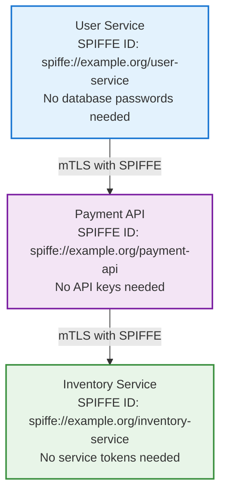

# The End of "Secret Zero" - SPIFFE/SPIRE Integration for Workload Owners

**🔐 From Secrets Management Nightmare → 🚀 Zero-Trust Identity → 🛡️ Maximum Security**

## The Problem Every Workload Owner Faces

You're building a microservice. It needs to authenticate with databases, APIs, and other services. The traditional approach? **Secrets everywhere**:

```bash
# The old way - secrets proliferation
DATABASE_PASSWORD=super_secret_123
API_KEY=ak_live_5c8d2e4f9a1b3c6d
JWT_SECRET=my_jwt_signing_key_456
SERVICE_ACCOUNT_TOKEN=eyJhbGci...
```

But here's the catch: **How do you securely deliver these secrets to your workload?** 

- Store them in environment variables? 🚫 Visible in process lists
- Mount them as files? 🚫 Readable by anyone with filesystem access  
- Use a secrets manager? 🚫 Now you need credentials to access the secrets manager
- Hardcode them? 🚫 Security nightmare

This is the **"Secret Zero" problem** - you always need one secret to get other secrets, creating an infinite recursion of trust issues.

## The SPIFFE Solution: Identity-Based Security

**What if your workload could prove who it is without any pre-shared secrets?**

SPIFFE (Secure Production Identity Framework for Everyone) solves this by giving workloads cryptographic identities based on **where they run** and **what they are**, not on secrets they carry.

```bash
# The SPIFFE way - no secrets needed
SPIFFE_ID="spiffe://example.org/payment-service"
# ↑ This identity is cryptographically verifiable
# ↑ Automatically rotated
# ↑ Based on workload properties, not secrets
```

## Your Journey: From Secrets to Identity

This project takes you through a complete transformation:

### 🎯 **Step 1: See The Problem** 
Experience the traditional secrets management approach and its limitations

### 🔍 **Step 2: Discover SPIFFE**
Learn how workloads can authenticate without pre-shared secrets

### 🛠️ **Step 3: Hands-On Integration**
Build real services that use SPIFFE identities for authentication

### 🚀 **Step 4: Production Readiness**
Understand how to deploy this in real environments

---

## 🚀 Quick Start - Your SPIFFE Journey Begins

### **One Command to Zero-Trust Security**

```bash
# Launch your complete SPIFFE learning environment
./scripts/fresh-install.sh
```

**✨ What happens next:**
- 🏗️ **Complete SPIRE infrastructure** deploys locally (3-4 minutes)
- 📊 **Real-time dashboard** shows identity propagation at http://localhost:3000/web-dashboard.html
- 🔐 **Three demo services** demonstrate SPIFFE integration patterns
- 🧪 **Interactive examples** let you experiment with identity-based auth
- 🛠️ **Auto-fix verification** ensures all servers are working properly

**🧹 When you're done for the day:**
```bash
# Clean shutdown - stops all servers, removes clusters, frees resources
./scripts/teardown.sh
```

<details>
<summary>📋 Prerequisites - Get Ready for Zero-Trust</summary>

### System Requirements
- **macOS** (tested and optimized)
- **Docker Desktop or Rancher Desktop** (container runtime)
- **8GB+ RAM** (recommended for smooth experience)

### Install Required Tools
```bash
brew install minikube kubectl node jq
```

### Why These Tools?
- **minikube**: Creates your local Kubernetes "production" environment
- **kubectl**: Manages your identity infrastructure  
- **node**: Powers the real-time identity dashboard
- **jq**: Processes identity and certificate data

> **🔒 Security Note**: SPIRE requires specific Kubernetes security policies. See [Security Policy Requirements](docs/spire_security_policies.md) for namespace configuration details.

</details>

---

## 🎬 The Demo: Three Services, Zero Secrets

Your environment includes three realistic services that demonstrate the SPIFFE integration journey:

### 🏪 **E-Commerce Platform Without Secrets**



### 🔍 **What You'll Learn**

1. **Identity Bootstrapping**: How services get their initial SPIFFE identity
2. **Mutual Authentication**: Services verify each other without shared secrets
3. **Certificate Rotation**: Automatic credential refresh without downtime
4. **Service Discovery**: Finding and trusting services by identity
5. **Zero-Trust Networking**: Every connection is verified

---

## 🛠️ Hands-On Learning - Build Your Understanding

### **🔬 Experiment 1: Watch Identity Propagation**

```bash
# Open your identity dashboard
open http://localhost:3000/web-dashboard.html

# Watch services receive and use their identities in real-time
# Click any service to see detailed certificate information
```

### **🔬 Experiment 2: Verify Zero-Secret Authentication**

```bash
# See how services authenticate to each other
kubectl --context workload-cluster -n spire-workload exec deployment/user-service -- \
  /opt/spire/bin/spire-agent api fetch -socketPath /run/spire/sockets/agent.sock

# This shows the X.509 certificate your service uses - no passwords!
```

### **🔬 Experiment 3: Create Your Own SPIFFE Service**

```bash
# Register a new service identity
kubectl --context workload-cluster -n spire-server exec spire-server-0 -- \
  /opt/spire/bin/spire-server entry create \
  -spiffeID spiffe://example.org/my-new-service \
  -parentID spiffe://example.org/node \
  -selector k8s:deployment:my-new-service

# Deploy your service and watch it automatically receive its identity
```

### **🔬 Experiment 4: Break and Fix Authentication**

```bash
# Temporarily break service identity to see what happens
kubectl --context workload-cluster -n spire-system delete pod -l app=spire-agent

# Watch dashboard show authentication failures
# See automatic recovery when agent restarts
# Learn why identity-based auth is resilient
```

---

## 🏗️ The Architecture - How Zero-Trust Works

### **🔧 Your Local Zero-Trust Environment**

```
workload-cluster (Your Testing Ground)
├── spire-server namespace
│   ├── 🏛️ SPIRE Server (Certificate Authority)
│   └── 💾 Database (Identity Registry - no secrets!)
├── spire-system namespace  
│   └── 🤖 SPIRE Agent (Identity Provider)
└── spire-workload namespace
    ├── 👤 user-service (proves identity via deployment)
    ├── 💳 payment-api (proves identity via selectors) 
    └── 📦 inventory-service (proves identity via labels)
```

> **💡 Learning Environment**: Each service runs as a single pod for clarity and resource efficiency. In production, you'd typically run multiple replicas for high availability.

### **🔐 How Services Get Identity (No Secrets Required)**

1. **Workload Starts**: Your service deploys to Kubernetes
2. **Agent Detects**: SPIRE Agent sees the new workload
3. **Attestation**: Agent verifies workload properties (namespace, labels, etc.)
4. **Certificate Issued**: SPIRE Server issues X.509 certificate with SPIFFE ID
5. **Identity Ready**: Service can now authenticate without any pre-shared secrets

### **🤝 How Services Authenticate Each Other**

```bash
# Service A wants to call Service B

# 1. Service A retrieves its certificate from SPIRE Agent
curl unix:/run/spire/sockets/agent.sock

# 2. Service A makes mTLS connection to Service B
# 3. Both services exchange and verify certificates
# 4. SPIFFE IDs in certificates determine authorization
# 5. Connection established - no secrets were transmitted!
```

---

## 🧪 Advanced Integration Patterns

### **📊 Monitor Your Zero-Trust Environment**

```bash
# Comprehensive health check
./scripts/verify-setup.sh

# Watch all identity operations in real-time
kubectl --context workload-cluster -n spire-system logs -l app=spire-agent -f
kubectl --context workload-cluster -n spire-server logs -l app=spire-server -f
```

### **🔍 Debug Identity Issues**

```bash
# Check trust bundle (root certificates)
kubectl --context workload-cluster -n spire-server exec spire-server-0 -- \
  /opt/spire/bin/spire-server bundle show

# List all registered identities
kubectl --context workload-cluster -n spire-server exec spire-server-0 -- \
  /opt/spire/bin/spire-server entry show

# Verify workload can fetch its identity
kubectl --context workload-cluster -n spire-workload exec deployment/user-service -- \
  /opt/spire/bin/spire-agent api fetch -socketPath /run/spire/sockets/agent.sock
```

### **🚀 Test Certificate Rotation**

```bash
# Force certificate refresh (simulates rotation)
kubectl --context workload-cluster -n spire-system delete pod -l app=spire-agent

# Watch services maintain connections during rotation
# This demonstrates zero-downtime identity refresh
```

<details>
<summary>🛠️ Troubleshooting Your Identity Infrastructure</summary>

### Quick Health Checks
```bash
# Verify all components are running
minikube profile list
kubectl --context workload-cluster get pods --all-namespaces

# Test dashboard connectivity
curl http://localhost:3000/api/pod-data

# Manual environment rebuild if needed
./scripts/fresh-install.sh
```

### Common Integration Issues
- **Identity not issued**: Check workload selectors match deployment
- **Authentication failures**: Verify trust bundle is distributed
- **Certificate errors**: Ensure clocks are synchronized
- **Connection refused**: Check SPIRE Agent socket permissions

### SPIFFE Integration Best Practices
- Use specific selectors for workload registration
- Implement proper certificate validation in your applications  
- Monitor certificate expiration and rotation
- Test failure scenarios (agent down, server unavailable)

</details>

---

## 🧹 Environment Management - Clean Up When Done

### **🛑 Complete Environment Teardown**

When you're done testing for the day or need a fresh start:

```bash
# Clean up everything - clusters, containers, servers, temp files
./scripts/teardown.sh
```

**✨ What gets cleaned:**
- 🗑️ **All Minikube clusters** (workload-cluster)
- 🗑️ **All running servers** (dashboard at :3000, docs at :8000)
- 🗑️ **Docker containers and images** (SPIRE-related)
- 🗑️ **Temporary files and caches** 
- ⚙️ **kubectl contexts** (reset to default)

**💾 What stays safe:**
- 📁 **Your project code** and configuration files
- 🐳 **Base Docker images** (for faster next startup)
- ⚙️ **System settings** and preferences

### **🎯 When to Use Teardown**

| Situation | Command | Reason |
|-----------|---------|--------|
| **End of testing day** | `./scripts/teardown.sh` | Free up system resources |
| **Need fresh environment** | `./scripts/teardown.sh` + `./scripts/fresh-install.sh` | Start with clean slate |
| **Something feels broken** | `./scripts/teardown.sh` + `./scripts/fresh-install.sh` | Reset to known good state |
| **Switching projects** | `./scripts/teardown.sh` | Clean up before other work |
| **Low disk space** | `./scripts/teardown.sh` | Free Docker volumes and images |

### **🔄 Quick Restart Workflow**

```bash
# End of day cleanup
./scripts/teardown.sh

# Next day startup
./scripts/fresh-install.sh

# Quick verification
open http://localhost:3000/web-dashboard.html
```

---

## 🎯 Integration Patterns - Bring SPIFFE to Your Services

### **Pattern 1: Database Authentication (No Passwords)**

```go
// Traditional approach
db, err := sql.Open("postgres", "user=admin password=secret123 host=db")

// SPIFFE approach  
tlsConfig := spiffetls.TLSClientConfig(source)
db, err := sql.Open("postgres", "user=admin sslmode=require host=db")
db.SetTLSConfig(tlsConfig) // Uses SPIFFE certificate automatically
```

### **Pattern 2: Service-to-Service Authentication**

```go
// Traditional approach
client := &http.Client{
    Headers: map[string]string{
        "Authorization": "Bearer " + os.Getenv("API_KEY"),
    },
}

// SPIFFE approach
client := &http.Client{
    Transport: &http.Transport{
        TLSClientConfig: spiffetls.TLSClientConfig(source),
    },
}
// Automatic mutual authentication based on SPIFFE IDs
```

### **Pattern 3: Message Queue Integration**

```go
// Traditional approach  
config := sarama.NewConfig()
config.Net.SASL.User = os.Getenv("KAFKA_USER")
config.Net.SASL.Password = os.Getenv("KAFKA_PASSWORD")

// SPIFFE approach
config := sarama.NewConfig()
config.Net.TLS.Config = spiffetls.TLSClientConfig(source)
// Identity-based authorization, no credentials needed
```

---

## 🚀 Your Next Steps - From Demo to Production

### **🎓 Master the Fundamentals**
1. **Run the demo**: `./scripts/fresh-install.sh`  
2. **Explore the dashboard**: http://localhost:3000/web-dashboard.html
3. **Experiment with identities**: Try the hands-on examples above
4. **Break things**: Learn by testing failure scenarios

### **🔧 Integrate with Your Services**
1. **Study the demo services**: See how they implement SPIFFE
2. **Add SPIFFE to your code**: Use the integration patterns above
3. **Test locally**: Deploy your service in this environment
4. **Validate identity flow**: Ensure proper authentication

### **🏢 Production Planning**
1. **Understand your requirements**: What services need identity?
2. **Plan your trust domains**: How will you organize identities?
3. **Design registration policies**: What selectors will you use?
4. **Prepare for operations**: Monitoring, rotation, recovery

<details>
<summary>📁 Project Structure - Navigate Your Learning Environment</summary>

```
spire-dev/
├── k8s/workload-cluster/         # Demo services with SPIFFE integration
│   ├── user-service-deployment.yaml      # Identity-based user service
│   ├── payment-api-deployment.yaml       # Identity-based payment API  
│   └── inventory-service-deployment.yaml # Identity-based inventory service
├── k8s/spire-server/            # Identity infrastructure
│   ├── server-statefulset.yaml          # Certificate Authority
│   └── server-configmap.yaml            # Trust domain configuration
├── scripts/                     # Automation and testing
│   ├── fresh-install.sh                 # Complete environment setup
│   └── verify-setup.sh                  # Identity verification tests
├── web/                         # Real-time identity dashboard
│   ├── web-dashboard.html               # Identity visualization
│   └── server.js                        # Dashboard backend
└── docs/                        # Integration guides and examples
```

</details>

---

## 🎉 Welcome to the Future of Authentication

**Traditional Security**: *"Here's a secret, guard it with your life"*  
**SPIFFE Security**: *"Here's who you are, prove it cryptographically"*

This isn't just a demo - it's a **paradigm shift** from secret-based to identity-based security. Every connection is verified, every certificate automatically rotated, every service authenticated without storing a single secret.

**🚀 Ready to eliminate Secret Zero forever?**

Start your journey: `./scripts/fresh-install.sh`

---

**🔐 No Secrets → 🎯 Strong Identity → 🛡️ Zero-Trust Security** ⚡