# SPIFFE/SPIRE Local Development Environment

**🚀 One-Command Setup → 📊 Interactive Dashboard → 🔧 Local Development**

Complete local SPIFFE/SPIRE development environment with real-time monitoring dashboard. Perfect for development, testing, and SPIFFE/SPIRE integration learning.

## 🚀 Quick Start

### **One-Command Setup**

**🔧 Basic Development Setup:**
```bash
# Complete local SPIRE development environment with dashboard
./scripts/fresh-install.sh
```

**🏢 Enterprise Architecture Setup:**
```bash
# Enterprise upstream/downstream clusters with federation
./scripts/fresh-install.sh enterprise
```

**🏢 CRD-Free Enterprise Setup:**
```bash
# Enterprise deployment without CRDs (for restricted environments)
./scripts/setup-crd-free-deployment.sh
```

**✨ Dashboard Ready:** http://localhost:3000/web-dashboard.html

- 🧹 **Clean Setup**: Tears down existing environment and rebuilds from scratch
- 📊 **Real-time Dashboard**: Live monitoring with clickable pod inspection
- 🏢 **Enterprise Ready**: Supports basic, enterprise, and CRD-free deployments
- 🔒 **CRD-Free Option**: For enterprises with strict CRD/privilege restrictions
- ⚡ **Fast**: ~5-8 minutes to fully operational environment (including image pulls)

<details>
<summary>📋 Prerequisites & Installation</summary>

### System Requirements
- **macOS** (designed and tested on macOS)
- **Container runtime**: Docker Desktop or Rancher Desktop
- **8GB+ RAM** recommended
- **SSD storage** recommended for optimal performance

### Required Tools
Install via Homebrew:
```bash
brew install minikube kubectl node jq
```

### Dependencies
- **minikube**: Creates local Kubernetes clusters
- **kubectl**: Kubernetes command-line tool
- **node**: Node.js runtime for dashboard server
- **jq**: JSON processor for API data handling

</details>

## 📊 Interactive Dashboard

The dashboard provides **real-time monitoring** for SPIFFE/SPIRE development:

### **Key Features**
- **📈 Live Metrics**: Real-time pod status from all SPIRE components
- **🔍 Drilldown Debugging**: Click any pod name for detailed `kubectl describe` output
- **🎯 Health Monitoring**: Component status with health scoring
- **🔐 Security Context**: Safe access to authorized namespaces only

### **Dashboard Usage**
```bash
# Dashboard automatically starts with setup
./scripts/fresh-install.sh

# Dashboard URL: http://localhost:3000/web-dashboard.html
open http://localhost:3000/web-dashboard.html

# Manual dashboard control (if needed)
./web/start-dashboard.sh
```

### **Perfect for:**
- Testing SPIFFE identity propagation across services
- Debugging SPIRE agent connectivity issues
- Monitoring certificate lifecycle during development
- Validating configuration changes instantly
- Learning SPIFFE/SPIRE concepts hands-on

## 🏗️ Architecture

### **🔧 Basic Development Environment**
Single-cluster architecture for reliable SPIFFE/SPIRE development:

```
workload-cluster (Primary)
├── spire-server namespace
│   ├── SPIRE Server (identity control plane)
│   └── Database (registration entries)
├── spire-system namespace
│   └── SPIRE Agent (workload attestation)
└── production namespace
    ├── user-service (authentication API)
    ├── payment-api (financial transactions)
    └── inventory-service (supply chain)
```

### **🏢 Enterprise Multi-Cluster Architecture**
Production-ready upstream/downstream trust hierarchy:

```mermaid
graph TD
    A["🔒 UPSTREAM CLUSTER<br/>Root Certificate Authority<br/>Trust Domain: enterprise-root.org"]
    B["🌐 DOWNSTREAM CLUSTER<br/>Regional Workload Cluster<br/>Trust Domain: downstream.example.org"]
    
    A -.->|Federation| B
    
    style A fill:#e1f5fe,stroke:#01579b,stroke-width:2px
    style B fill:#f3e5f5,stroke:#4a148c,stroke-width:2px
```



### **🔒 CRD-Free Enterprise Architecture**
For enterprises with strict CRD and privilege restrictions:

```mermaid
graph TD
    A["🏢 EXTERNAL INFRASTRUCTURE<br/>Outside Kubernetes<br/>SPIRE Servers and Database<br/>Certificate Authority Chain"]
    B["🔧 KUBERNETES CLUSTER<br/>Agents Only - No CRDs<br/>SPIRE Agents DaemonSet<br/>Custom Registration Service"]
    
    A -.->|gRPC/HTTPS| B
    
    style A fill:#ffcdd2,stroke:#d32f2f,stroke-width:2px
    style B fill:#e1f5fe,stroke:#01579b,stroke-width:2px
```



## 🔧 Development & Testing

### **Verification & Health Monitoring**
```bash
# Comprehensive environment verification
./scripts/verify-setup.sh

# Features:
# - Real-time component status with health scoring
# - Network connectivity and SPIFFE ID availability tests
# - Dashboard API testing for real vs mock data
# - Overall environment health with recommendations
```

### **SPIFFE/SPIRE Integration Testing**
```bash
# Check all components
kubectl --context workload-cluster -n spire-server get pods
kubectl --context workload-cluster -n spire-system get pods
kubectl --context workload-cluster -n production get pods

# View SPIFFE identities and registrations
kubectl --context workload-cluster -n spire-server exec spire-server-0 -- \
  /opt/spire/bin/spire-server entry show

# Test workload SPIFFE ID retrieval
kubectl --context workload-cluster -n production exec deployment/user-service -- \
  /opt/spire/bin/spire-agent api fetch -socketPath /run/spire/sockets/agent.sock

# Reset environment anytime for clean testing
./scripts/fresh-install.sh
```

### **Common SPIRE Operations**
```bash
# Register a new workload identity
kubectl --context workload-cluster -n spire-server exec spire-server-0 -- \
  /opt/spire/bin/spire-server entry create \
  -spiffeID spiffe://example.org/myworkload \
  -parentID spiffe://example.org/myagent \
  -selector k8s:deployment:myworkload

# Check trust bundle
kubectl --context workload-cluster -n spire-server exec spire-server-0 -- \
  /opt/spire/bin/spire-server bundle show

# Monitor agent logs for troubleshooting
kubectl --context workload-cluster -n spire-system logs -l app=spire-agent -f
```

<details>
<summary>🛠️ Troubleshooting & Advanced Usage</summary>

### Quick Diagnostics
```bash
# Check overall cluster health
minikube profile list

# Dashboard verification
curl http://localhost:3000/api/pod-data

# Manual step-by-step setup
./scripts/setup-clusters.sh
./scripts/verify-setup.sh
./web/start-dashboard.sh
```

### Common Solutions
- **Environment inconsistencies**: Fresh install guarantees clean state
- **Pod security violations**: Automatic privileged label configuration
- **Bundle creation failures**: Enhanced retry logic with proper socket paths
- **Timeout issues**: Extended waits handle startup delays
- **Dashboard issues**: Integrated startup validation with retry logic

### Network Architecture
**Single-cluster deployment** ensures reliable connectivity:
- SPIRE Server and Agent in same cluster eliminates network isolation issues
- Agent uses `spire-server.spire-server.svc.cluster.local:8081` for communication
- Simplified networking reduces complexity and startup time

</details>

<details>
<summary>📁 Project Structure</summary>

```
spire-dev/
├── k8s/                          # Kubernetes manifests
│   ├── spire-server/             # SPIRE server and database
│   └── workload-cluster/         # Agents and workload services
├── scripts/                      # Setup and utility scripts
│   ├── fresh-install.sh          # Main fresh install script
│   ├── setup-clusters.sh         # Manual cluster setup
│   └── verify-setup.sh           # Verification and testing
├── web/                          # Web dashboard
│   ├── web-dashboard.html        # Main dashboard interface
│   ├── server.js                 # Node.js server
│   └── start-dashboard.sh        # Startup script
├── docs/                         # Documentation
└── helm-charts/                  # Helm deployment configurations
```

</details>

## 🎯 Learning SPIFFE/SPIRE

This environment is designed for hands-on learning of SPIFFE/SPIRE concepts:

### **Core Concepts Demonstrated**
- **SPIFFE ID**: Unique identity format (spiffe://trust-domain/path)
- **SVID**: SPIFFE Verifiable Identity Document (X.509 certificates)
- **Trust Bundle**: Root CA certificates for trust domain validation
- **Workload Attestation**: How workloads prove their identity
- **Node Attestation**: How agents prove their identity to servers

### **Practical Examples**
- Multi-service communication with mutual TLS
- Workload identity registration and management
- Certificate rotation and lifecycle management
- Federation between trust domains
- Integration with service meshes and API gateways

## 🎉 Next Steps

1. **Start with setup**: `./scripts/fresh-install.sh`
2. **Open dashboard**: http://localhost:3000/web-dashboard.html
3. **Explore SPIRE components**: Use verification script and common operations
4. **Test SPIFFE integration**: Modify workload deployments in `k8s/workload-cluster/`
5. **Learn by doing**: Register new workloads and test identity propagation

---

**🚀 Local SPIFFE/SPIRE Development → 📊 Real-time Monitoring → 🔧 Integration Testing** ⚡