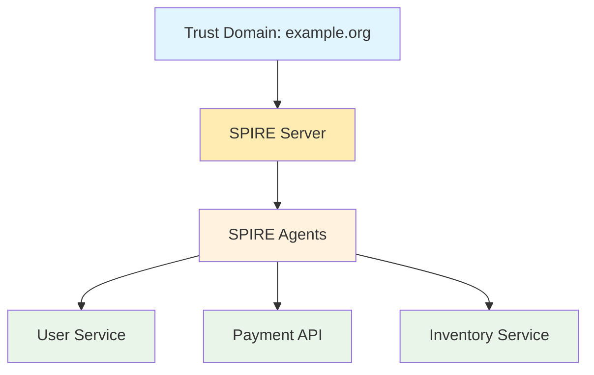
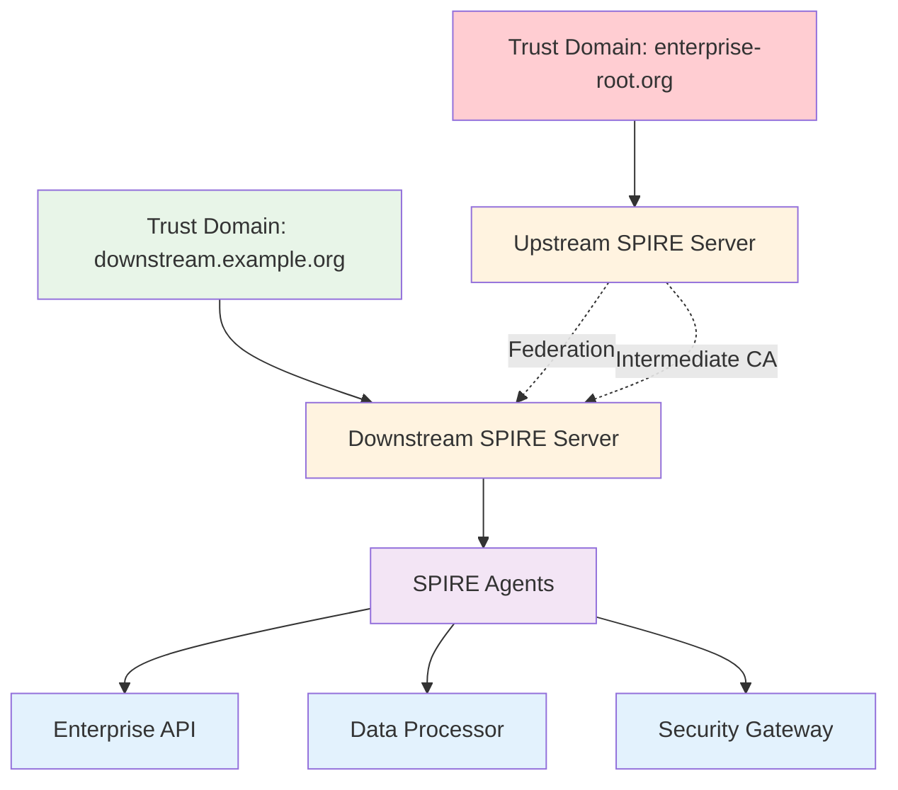
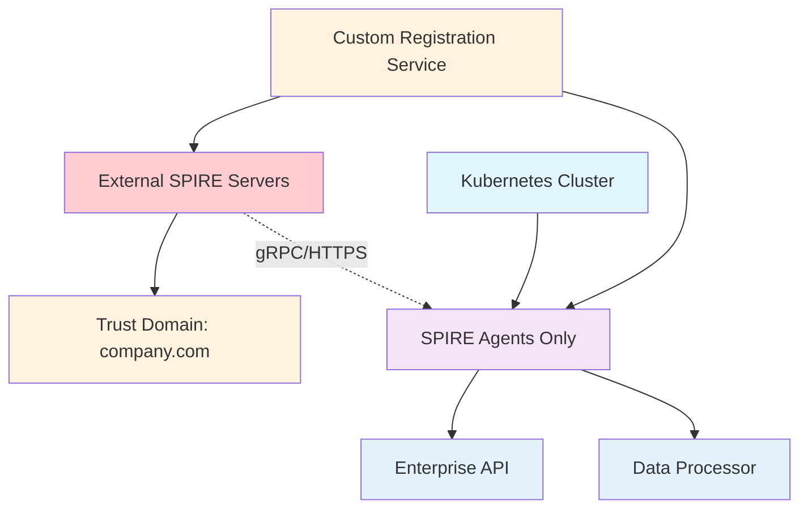

# Architecture Overview

This section provides a comprehensive overview of the SPIRE deployment architectures supported by this project, from basic development setups to enterprise-grade multi-cluster deployments.

## Deployment Architecture Options

This project supports three distinct deployment architectures to meet different organizational requirements:

<div class="grid cards" markdown>

-   :fontawesome-solid-laptop:{ .lg .middle } **Basic Development**

    ---

    Single cluster deployment optimized for local development and testing.

    **Best for**: Learning, development, prototyping

    [:octicons-arrow-right-24: Learn More](../deployment/basic-development.md)

-   :fontawesome-solid-building:{ .lg .middle } **Enterprise Multi-Cluster**

    ---

    Production-ready upstream/downstream trust hierarchy with federation.

    **Best for**: Production deployments, multi-region setups

    [:octicons-arrow-right-24: Learn More](enterprise-architecture.md)

-   :fontawesome-solid-lock:{ .lg .middle } **CRD-Free Enterprise**

    ---

    Enterprise deployment without Custom Resource Definitions for restricted environments.

    **Best for**: Highly regulated environments, strict security policies

    [:octicons-arrow-right-24: Learn More](crd-free-architecture.md)

</div>

## Architecture Comparison

| Feature | Basic | Enterprise | CRD-Free |
|---------|-------|------------|----------|
| **Clusters** | 1 | 2 | 1 |
| **Trust Domains** | 1 | 2 | 1 |
| **CRDs Required** | No | Yes | No |
| **Cluster Privileges** | Limited | Extensive | Minimal |
| **Federation** | No | Yes | External |
| **Production Ready** | Development | Yes | Yes |
| **Compliance** | Basic | Standard | High |

## Trust Domain Hierarchy

### Basic Development



### Enterprise Multi-Cluster



### CRD-Free Enterprise



## Component Architecture

### Core Components

All deployments include these fundamental SPIRE components:

#### SPIRE Server
- **Role**: Certificate Authority and Identity Provider
- **Function**: Issues and manages SPIFFE identities
- **Storage**: PostgreSQL database for registration entries
- **API**: gRPC API for agent communication

#### SPIRE Agent
- **Role**: Workload Identity Provider
- **Function**: Attests workloads and provides SPIFFE identities
- **Deployment**: DaemonSet on all worker nodes
- **Communication**: Unix domain socket to workloads

#### Workloads
- **Role**: Application services requiring identity
- **Function**: Consume SPIFFE identities for mTLS communication
- **Examples**: APIs, microservices, databases

### Enterprise Components

Enterprise deployments add these components:

#### Federation
- **Purpose**: Cross-domain trust relationships
- **Function**: Enables workloads in different trust domains to communicate
- **Implementation**: Trust bundle exchange between SPIRE servers

#### Controller Manager (CRD-based only)
- **Purpose**: Kubernetes-native workload registration
- **Function**: Automatically registers workloads based on Kubernetes resources
- **Requirements**: Custom Resource Definitions and cluster privileges

#### External Registration Service (CRD-free only)
- **Purpose**: Workload registration without CRDs
- **Function**: Watches Kubernetes resources and registers with external SPIRE servers
- **Benefits**: No cluster privileges required

## Security Architecture

### Trust Model

All architectures implement the SPIFFE trust model:

1. **Root of Trust**: SPIRE Server acts as Certificate Authority
2. **Node Identity**: Kubernetes nodes attested via service account tokens
3. **Workload Identity**: Applications attested via Kubernetes selectors
4. **Identity Format**: SPIFFE IDs in URI format (spiffe://domain/path)

### Certificate Hierarchy

=== "Basic Development"
    ```
    Self-Signed Root CA
    └── SPIRE Server CA
        └── Workload SVIDs
    ```

=== "Enterprise Multi-Cluster"
    ```
    External Root CA (optional)
    └── Upstream SPIRE Server (Root CA)
        └── Downstream SPIRE Server (Intermediate CA)
            └── Workload SVIDs
    ```

=== "CRD-Free Enterprise"
    ```
    External Root CA
    └── External SPIRE Servers
        └── Kubernetes Workload SVIDs
    ```

### Network Security

All deployments implement:

- **mTLS**: All service-to-service communication
- **TLS**: All SPIRE server communication
- **Unix Sockets**: Agent-to-workload communication
- **Federation HTTPS**: Cross-domain trust bundle exchange

## Scalability Considerations

### Basic Development
- **Scope**: Single developer or small team
- **Limits**: Single cluster, limited resources
- **Scaling**: Not designed for production scale

### Enterprise Multi-Cluster
- **Scope**: Production workloads across regions
- **Limits**: Designed for high availability and scale
- **Scaling**: Horizontal server scaling, multiple regions

### CRD-Free Enterprise
- **Scope**: Compliance-focused enterprise environments
- **Limits**: External infrastructure dependent
- **Scaling**: Scales with external SPIRE infrastructure

## Monitoring and Observability

### Dashboard Integration

All deployments include:

- **Real-time Monitoring**: Live pod status and health indicators
- **Multi-Cluster Support**: Automatic detection of deployment type
- **Interactive Debugging**: Click-through pod inspection
- **Health Scoring**: Component health aggregation

### Metrics and Alerting

Enterprise deployments support:

- **Prometheus Integration**: SPIRE server metrics export
- **Custom Metrics**: Application-specific identity metrics
- **Alerting**: Certificate expiration and service health alerts
- **Audit Logging**: Identity issuance and usage tracking

## Next Steps

Choose your deployment architecture based on your requirements:

- **Learning SPIRE**: Start with [Basic Development](../deployment/basic-development.md)
- **Production Deployment**: Review [Enterprise Architecture](enterprise-architecture.md)
- **Compliance Requirements**: Consider [CRD-Free Architecture](crd-free-architecture.md)

For detailed implementation guides, see the [Deployment Guides](../deployment/basic-development.md) section.