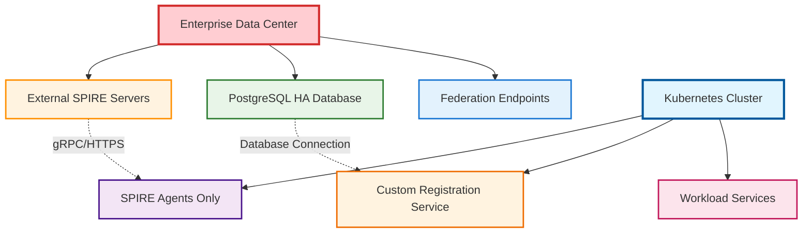

# SPIRE Enterprise CRD Requirements and Alternatives

This document addresses the critical question of Custom Resource Definition (CRD) requirements for SPIRE enterprise deployments on Kubernetes, particularly for organizations with strict CRD and elevated privilege policies.

## Executive Summary

!!! warning "CRDs Required for Modern Deployments"
    **CRDs ARE REQUIRED** for modern enterprise SPIRE deployments using the recommended SPIRE Controller Manager approach. However, alternative deployment patterns exist for enterprises with CRD restrictions.

!!! info "Key Finding"
    The SPIRE Controller Manager (the current recommended approach) requires 3 cluster-scoped CRDs and elevated cluster privileges, which may conflict with enterprise security policies.

## CRD Requirements Analysis

### Required CRDs for SPIRE Controller Manager

Modern SPIRE enterprise deployments using the SPIRE Controller Manager require these cluster-scoped CRDs:

#### 1. ClusterSPIFFEID CRD

```yaml
apiVersion: apiextensions.k8s.io/v1
kind: CustomResourceDefinition
metadata:
  name: clusterspiffeids.spire.spiffe.io
spec:
  scope: Cluster  # ⚠️ CLUSTER-SCOPED RESOURCE
```

**Purpose**: Defines workload identity templates and selectors

**Privileges Required**: 

- Cluster-wide pod and namespace access
- Registration entry management
- SPIFFE ID template processing

#### 2. ClusterFederatedTrustDomain CRD

```yaml
apiVersion: apiextensions.k8s.io/v1
kind: CustomResourceDefinition
metadata:
  name: clusterfederatedtrustdomains.spire.spiffe.io
spec:
  scope: Cluster  # ⚠️ CLUSTER-SCOPED RESOURCE
```

**Purpose**: Manages federation relationships between trust domains

**Privileges Required**:

- Cross-cluster trust bundle management
- Federation endpoint configuration
- Trust relationship reconciliation

#### 3. ClusterStaticEntry CRD

```yaml
apiVersion: apiextensions.k8s.io/v1
kind: CustomResourceDefinition
metadata:
  name: clusterstaticicentries.spire.spiffe.io
spec:
  scope: Cluster  # ⚠️ CLUSTER-SCOPED RESOURCE
```

**Purpose**: Static SPIRE registration entries for non-Kubernetes workloads

**Privileges Required**:

- Static entry registration
- External workload integration
- Nested SPIRE server registration

### Required Cluster Privileges

The SPIRE Controller Manager requires extensive cluster-level permissions:

```yaml
apiVersion: rbac.authorization.k8s.io/v1
kind: ClusterRole
metadata:
  name: spire-controller-manager-role
rules:
# ⚠️ CLUSTER-WIDE PERMISSIONS REQUIRED
- apiGroups: [""]
  resources: ["pods", "nodes", "services", "endpoints"]
  verbs: ["get", "list", "watch"]
- apiGroups: ["apps"]
  resources: ["replicasets", "deployments", "daemonsets"]
  verbs: ["get", "list", "watch"]
- apiGroups: ["spire.spiffe.io"]
  resources: ["clusterspiffeids", "clusterfederatedtrustdomains", "clusterstaticicentries"]
  verbs: ["get", "list", "watch", "create", "update", "patch", "delete"]
# Additional elevated privileges for admission controllers
- apiGroups: ["admissionregistration.k8s.io"]
  resources: ["validatingadmissionwebhooks", "mutatingadmissionwebhooks"]
  verbs: ["get", "list", "watch", "create", "update", "patch", "delete"]
```

## Enterprise Deployment Challenges

### Common Enterprise Restrictions

Many enterprise Kubernetes environments impose these restrictions:

!!! danger "CRD Installation Policies"
    ```
    ❌ No cluster-scoped CRD installation by application teams
    ❌ CRDs require security review (3-6 month approval process)
    ❌ Only platform teams can install CRDs
    ❌ No third-party CRDs in production
    ```

!!! danger "Privilege Restrictions"
    ```
    ❌ No cluster-admin privileges for applications
    ❌ Applications limited to namespace-scoped permissions
    ❌ No admission webhook creation
    ❌ No cluster-wide resource access
    ```

!!! danger "Compliance Requirements"
    ```
    ❌ SOX compliance prohibits cluster-wide resource modification
    ❌ PCI-DSS requires strict privilege separation
    ❌ FedRAMP mandates least-privilege access
    ❌ ISO 27001 restricts cross-namespace access
    ```

## Alternative Deployment Patterns

### Option 1: Legacy Workload Registrar (Annotation-Based)

!!! warning "Deprecated Approach"
    **Status**: ⚠️ **DEPRECATED** - No longer maintained by SPIFFE project

```yaml
# Legacy deployment without CRDs
apiVersion: apps/v1
kind: Deployment
metadata:
  name: k8s-workload-registrar
spec:
  template:
    spec:
      containers:
      - name: k8s-workload-registrar
        image: ghcr.io/spiffe/k8s-workload-registrar:1.8.0
        args:
        - -config
        - /run/spire/config/k8s-workload-registrar.conf
```

**Configuration**:
```hcl
trust_domain = "example.org"
server_socket_path = "/run/spire/sockets/server.sock"
cluster = "demo-cluster"
mode = "reconcile"  # No CRDs required

# Annotation-based workload selection
pod_label = "spiffe.io/spire-managed-identity"
pod_annotation = "spiffe.io/spiffe-id"
```

**Limitations**:

- No longer maintained or supported
- Security vulnerabilities not patched
- Limited federation capabilities
- Deprecated APIs

### Option 2: Manual Registration Pattern

**Approach**: External registration service without CRDs

```yaml
# Custom registration service
apiVersion: apps/v1
kind: Deployment
metadata:
  name: spire-registration-service
spec:
  template:
    spec:
      containers:
      - name: registrar
        image: custom/spire-registrar:latest
        env:
        - name: SPIRE_SERVER_ADDRESS
          value: "spire-server:8081"
```

**Benefits**:

- No CRDs required
- Namespace-scoped permissions only
- Custom business logic integration
- Compliance-friendly

**Limitations**:

- Custom development and maintenance required
- No federation support
- Limited scalability
- Manual lifecycle management

### Option 3: External Service Integration

!!! success "Recommended for Enterprise"
    **Approach**: SPIRE servers outside Kubernetes cluster



**Configuration**:
```yaml
# Agent-only deployment in Kubernetes
apiVersion: apps/v1
kind: DaemonSet
metadata:
  name: spire-agent
spec:
  template:
    spec:
      containers:
      - name: spire-agent
        image: ghcr.io/spiffe/spire-agent:1.9.0
        args:
        - -config
        - /run/spire/config/agent.conf
```

**Agent Configuration**:
```hcl
agent {
    data_dir = "/run/spire"
    log_level = "INFO"
    server_address = "external-spire-server.company.com"  # External server
    server_port = "8081"
    trust_domain = "company.com"
}
```

**Benefits**:

- No CRDs in Kubernetes
- Existing enterprise SPIRE infrastructure integration
- Centralized management outside Kubernetes
- Compliance with enterprise policies

**Limitations**:

- Network complexity
- Reduced Kubernetes-native features
- External infrastructure requirements
- Limited automation

## Enterprise Decision Matrix

| Requirement | Controller Manager | Legacy Registrar | Manual Registration | External Service |
|-------------|-------------------|------------------|--------------------|-----------------| 
| **CRDs Required** | ❌ Yes (3 CRDs) | ✅ No | ✅ No | ✅ No |
| **Cluster Privileges** | ❌ Extensive | ⚠️ Limited | ✅ Namespace-only | ✅ Namespace-only |
| **Maintenance** | ✅ Supported | ❌ Deprecated | ❌ Custom | ⚠️ Hybrid |
| **Federation** | ✅ Full Support | ❌ Limited | ❌ Manual | ✅ Full Support |
| **Enterprise Compliance** | ❌ Often Blocked | ⚠️ Risk | ✅ Compliant | ✅ Compliant |
| **Scalability** | ✅ Excellent | ⚠️ Limited | ⚠️ Custom | ✅ Excellent |
| **Production Readiness** | ✅ Recommended | ❌ End-of-Life | ⚠️ Custom | ✅ Production Ready |

## Recommended Enterprise Approaches

### 🎯 Recommended: External Service Pattern

For enterprises with strict CRD restrictions, the **External Service Pattern** provides the best balance:

**Implementation Steps**:

1. Deploy SPIRE Servers outside Kubernetes (VMs/Bare Metal)
2. Configure enterprise-grade database (PostgreSQL HA)
3. Deploy SPIRE Agents as DaemonSet in Kubernetes (no CRDs)
4. Use external registration service for workload management
5. Implement federation at the external server level

**Architecture**:
```yaml
# spire-agent-only-deployment.yaml
apiVersion: apps/v1
kind: DaemonSet
metadata:
  name: spire-agent
  namespace: spire-system
spec:
  selector:
    matchLabels:
      app: spire-agent
  template:
    metadata:
      labels:
        app: spire-agent
    spec:
      hostPID: true
      hostNetwork: true
      dnsPolicy: ClusterFirstWithHostNet
      serviceAccountName: spire-agent
      containers:
      - name: spire-agent
        image: ghcr.io/spiffe/spire-agent:1.9.0
        args: ["-config", "/run/spire/config/agent.conf"]
        volumeMounts:
        - name: spire-config
          mountPath: /run/spire/config
          readOnly: true
        - name: spire-bundle
          mountPath: /run/spire/bundle
          readOnly: true
        - name: spire-agent-socket
          mountPath: /run/spire/sockets
        resources:
          requests:
            memory: 128Mi
            cpu: 100m
          limits:
            memory: 256Mi
            cpu: 200m
      volumes:
      - name: spire-config
        configMap:
          name: spire-agent-config
      - name: spire-bundle
        configMap:
          name: spire-bundle
      - name: spire-agent-socket
        hostPath:
          path: /run/spire/sockets
          type: DirectoryOrCreate
```

### 🔄 Migration Strategy: CRD Approval Process

If your organization can approve CRDs through proper channels:

=== "Phase 1: Documentation"
    - Create comprehensive security assessment
    - Document CRD requirements and privileges
    - Provide risk analysis and mitigation strategies

=== "Phase 2: Approval Process"
    - Submit CRD installation request to platform team
    - Include this document as justification
    - Highlight enterprise security benefits

=== "Phase 3: Pilot Deployment"
    - Deploy in non-production environment
    - Demonstrate security controls and compliance
    - Validate enterprise requirements

=== "Phase 4: Production Rollout"
    - Implement monitoring and alerting
    - Establish operational procedures
    - Plan for disaster recovery

## Implementation Recommendations

### For Organizations WITH CRD Approval Process

1. **Pursue CRD Approval** with comprehensive documentation
2. **Implement SPIRE Controller Manager** for full enterprise features
3. **Use GitOps** for CRD lifecycle management
4. **Implement monitoring** and security controls

### For Organizations WITHOUT CRD Approval

1. **Deploy External Service Pattern** as primary recommendation
2. **Use Agent-Only Kubernetes Deployment** with external registration
3. **Implement Custom Registration Service** for specific needs
4. **Plan Migration Path** for future CRD approval

### Hybrid Approach

```bash
# Phase 1: External Service (Immediate deployment)
Deploy SPIRE servers externally + Kubernetes agents

# Phase 2: CRD Approval (Parallel process)
Work with security/platform teams for CRD approval

# Phase 3: Migration (Future state)
Migrate to Controller Manager when CRDs approved
```

## Conclusion

!!! summary "Key Takeaways"
    1. **Modern SPIRE = CRDs Required**: The recommended SPIRE Controller Manager requires 3 cluster-scoped CRDs
    2. **Enterprise Alternatives Exist**: External service pattern provides full functionality without CRDs
    3. **Security Can Be Maintained**: Alternative approaches can meet enterprise security requirements
    4. **Migration Path Available**: Organizations can start with alternatives and migrate to CRDs when approved

### Recommendation

**For immediate enterprise deployment**: Use the [External Service Pattern](../deployment/crd-free-deployment.md)

**For long-term strategy**: Pursue CRD approval process in parallel

This approach ensures enterprises can deploy SPIRE immediately while working toward the optimal Controller Manager deployment model.