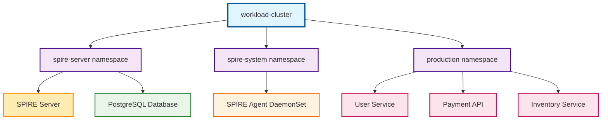
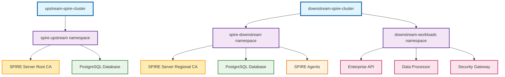
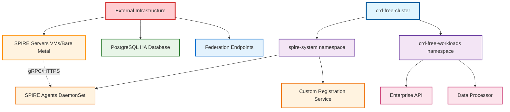

# Getting Started

Get up and running with SPIRE in minutes with our automated deployment scripts.

## Prerequisites

Before starting, ensure you have the required tools installed on your macOS system:

### System Requirements

- **macOS** (designed and tested on macOS)
- **Container runtime**: Docker Desktop or Rancher Desktop
- **8GB+ RAM** recommended
- **SSD storage** recommended for optimal performance

### Required Tools

Install via Homebrew:

```bash
brew install minikube kubectl node jq
```

| Tool | Purpose | Version |
|------|---------|---------|
| **minikube** | Creates local Kubernetes clusters | Latest |
| **kubectl** | Kubernetes command-line tool | Latest |
| **node** | Node.js runtime for dashboard server | Latest |
| **jq** | JSON processor for API data handling | Latest |

## Quick Start Options

Choose the deployment option that best fits your needs:

=== "Basic Development"

    Perfect for local development and testing:

    ```bash
    ./scripts/fresh-install.sh
    ```

    **Features:**
    
    - :fontawesome-solid-clock: 5-8 minutes setup time
    - :fontawesome-solid-laptop: Single cluster deployment
    - :fontawesome-solid-chart-line: Real-time dashboard
    - :fontawesome-solid-code: Development focused

=== "Enterprise Multi-Cluster"

    Production-ready upstream/downstream architecture:

    ```bash
    ./scripts/fresh-install.sh enterprise
    ```

    **Features:**
    
    - :fontawesome-solid-building: Hierarchical trust domains
    - :fontawesome-solid-network-wired: Federation between clusters
    - :fontawesome-solid-shield: Production-grade security
    - :fontawesome-solid-database: HA database support

=== "CRD-Free Enterprise"

    For organizations with strict CRD policies:

    ```bash
    ./scripts/fresh-install.sh crd-free
    ```

    **Features:**
    
    - :fontawesome-solid-lock: No Custom Resource Definitions
    - :fontawesome-solid-user-shield: Namespace-scoped permissions only
    - :fontawesome-solid-server: External SPIRE server integration
    - :fontawesome-solid-check-circle: Enterprise compliance ready

## Step-by-Step Installation

### 1. Clone the Repository

```bash
git clone <repository-url>
cd spire-dev
```

### 2. Choose Your Deployment

Run the installation command for your preferred deployment type:

!!! tip "First Time Setup"
    The script will automatically:
    
    - ✅ Check prerequisites
    - 🧹 Clean any existing environment
    - 🚀 Deploy fresh SPIRE clusters
    - 📊 Start the dashboard server
    - ✅ Validate the installation

### 3. Access the Dashboard

Once installation completes, access the interactive dashboard:

```bash
# Dashboard URL (automatically opens)
open http://localhost:3000/web-dashboard.html
```

**Dashboard Features:**

- 📈 **Live Metrics**: Real-time pod status from all SPIRE components
- 🔍 **Drilldown Debugging**: Click any pod name for detailed information
- 🎯 **Health Monitoring**: Component status with health scoring
- 🔐 **Security Context**: Safe access to authorized namespaces only

## Verification

After installation, verify your deployment:

=== "Basic Development"

    ```bash
    # Run verification script
    ./scripts/verify-setup.sh
    
    # Check cluster status
    kubectl --context workload-cluster get pods --all-namespaces
    ```

=== "Enterprise Multi-Cluster"

    ```bash
    # Run enterprise verification
    ./scripts/verify-enterprise-setup.sh
    
    # Check upstream cluster
    kubectl --context upstream-spire-cluster -n spire-upstream get pods
    
    # Check downstream cluster
    kubectl --context downstream-spire-cluster -n spire-downstream get pods
    ```

=== "CRD-Free Enterprise"

    ```bash
    # Verify no CRDs installed
    kubectl get crd | grep spire || echo "✅ CRD-free confirmed"
    
    # Check agent deployment
    kubectl --context crd-free-cluster -n spire-system get pods
    ```

## What Gets Installed

Depending on your deployment choice, the following components are installed:

### Basic Development



### Enterprise Multi-Cluster



### CRD-Free Enterprise



## Next Steps

After successful installation:

1. **Explore the Dashboard**: [http://localhost:3000/web-dashboard.html](http://localhost:3000/web-dashboard.html)
2. **Review Architecture**: [Architecture Overview](architecture/overview.md)
3. **Understand Deployment**: Choose your deployment guide:
   - [Basic Development](deployment/basic-development.md)
   - [Enterprise Deployment](deployment/enterprise-deployment.md)
   - [CRD-Free Deployment](deployment/crd-free-deployment.md)

## Troubleshooting

If you encounter issues during installation:

1. **Check Prerequisites**: Ensure all required tools are installed
2. **Review Logs**: Check the installation script output for errors
3. **Verify Resources**: Ensure sufficient CPU and memory resources
4. **Consult Troubleshooting**: [Troubleshooting Guide](operations/troubleshooting.md)

!!! warning "Common Issues"
    - **Port 3000 in use**: Stop any existing dashboard servers
    - **Insufficient resources**: Increase Docker Desktop memory allocation
    - **minikube issues**: Try `minikube delete --all` and restart

## Clean Reinstall

To perform a clean reinstall at any time:

```bash
# This will completely tear down existing environment
./scripts/fresh-install.sh [basic|enterprise|crd-free]
```

The script is **idempotent** - it safely tears down any existing environment before creating a fresh deployment.