# SPIRE Architecture Diagrams

This document provides visual representations of both basic and enterprise SPIRE deployments available in this project.

## Basic Development Architecture

### Minikube Cluster Layout

### Component Interaction Flow

## Enterprise Multi-Cluster Architecture

### Upstream and Downstream Topology

```mermaid
graph TB
    subgraph "🏢 ENTERPRISE MULTI-CLUSTER ARCHITECTURE (Hierarchical Trust Model)"
        subgraph "🏢 ENTERPRISE ROOT AUTHORITY"
            subgraph "🔒 Upstream SPIRE Cluster"
                subgraph "upstream-spire-cluster"
                    subgraph "Trust Domain: enterprise-root.org"
                        USS[🔐 SPIRE Server<br/>Root CA]
                        UDB[(🗃️ MySQL Database)]
                        UFE[🔗 Federation Endpoint]
                        UCM[⚙️ Controller Manager]
                        
                        USS --> UDB
                        USS --> UFE
                        UCM --> USS
                    end
                end
            end
        end
        
        subgraph "🌍 REGIONAL/WORKLOAD AUTHORITY"
            subgraph "🌐 Downstream SPIRE Cluster"
                subgraph "downstream-spire-cluster"
                    subgraph "Trust Domain: downstream.example.org"
                        DSS[🔐 SPIRE Server<br/>Regional CA]
                        DDB[(🗃️ MySQL Database)]
                        DSA[🤖 SPIRE Agents<br/>DaemonSet]
                        DCM[⚙️ Controller Manager]
                        
                        DSS --> DDB
                        DCM --> DSS
                        DSA --> DSS
                    end
                end
                
                subgraph "spire-downstream namespace"
                    CP[🔧 Control Plane Components]
                    TB[🔗 Trust Bundle Management]
                end
                
                subgraph "downstream-workloads namespace"
                    EA[🏢 Enterprise API]
                    DP[📊 Data Processor]
                    SG[🛡️ Security Gateway]
                end
                
                subgraph "🌐 External Access"
                    SGW[🔒 Security Gateway<br/>NodePort]
                    EXT[🌍 External Traffic Ingress]
                    
                    SGW --> EXT
                end
            end
        end
    end
    
    %% Federation relationship
    UFE -.->|🌐 Federation<br/>Trust Bundle| DSS
    DSS -.->|🌐 Federation<br/>Trust Bundle| UFE
    
    %% Workload connections
    DSA --> EA
    DSA --> DP
    DSA --> SG
    
    %% External access
    SG --> SGW
    
    %% Styling
    classDef upstream fill:#e1f5fe,stroke:#01579b,stroke-width:3px
    classDef downstream fill:#f3e5f5,stroke:#4a148c,stroke-width:3px
    classDef server fill:#ffecb3,stroke:#ff8f00,stroke-width:2px
    classDef database fill:#e8f5e8,stroke:#2e7d32,stroke-width:2px
    classDef agent fill:#fff3e0,stroke:#ef6c00,stroke-width:2px
    classDef workload fill:#fce4ec,stroke:#c2185b,stroke-width:2px
    classDef external fill:#f5f5f5,stroke:#424242,stroke-width:2px
    
    class USS,DSS server
    class UDB,DDB database
    class DSA agent
    class EA,DP,SG workload
    class SGW,EXT external
```

### Trust Hierarchy and Certificate Chain

```mermaid
graph TD
    ECA[External Enterprise CA<br/>Optional] --> USS
    
    subgraph "Trust Hierarchy & Certificate Chain"
        USS[🔒 Upstream SPIRE Server<br/>Root Certificate Authority<br/><br/>• Issues Intermediate Certs<br/>• Manages Trust Policies<br/>• Federation Bundle Endpoint<br/>• Trust Domain: enterprise-root.org]
        
        DSS[🌐 Downstream SPIRE Server<br/>Regional Certificate Authority<br/><br/>• Issues Workload SVIDs<br/>• Local Trust Management<br/>• Agent Attestation<br/>• Trust Domain: downstream.example.org]
        
        subgraph "🏢 Enterprise Workload Services"
            EA[🏢 enterprise-api<br/>SPIFFE ID: spiffe://downstream.example.org/enterprise-api]
            DP[📊 data-processor<br/>SPIFFE ID: spiffe://downstream.example.org/data-processor]
            SG[🛡️ security-gateway<br/>SPIFFE ID: spiffe://downstream.example.org/security-gateway]
        end
    end
    
    USS -->|Intermediate Certificate| DSS
    DSS -->|SVID Certificates| EA
    DSS -->|SVID Certificates| DP
    DSS -->|SVID Certificates| SG
    
    %% Styling
    classDef rootCA fill:#ffcdd2,stroke:#d32f2f,stroke-width:3px
    classDef intermediate fill:#fff3e0,stroke:#ff8f00,stroke-width:2px
    classDef workload fill:#e8f5e8,stroke:#388e3c,stroke-width:2px
    classDef optional fill:#f5f5f5,stroke:#757575,stroke-width:1px,stroke-dasharray: 5 5
    
    class ECA optional
    class USS rootCA
    class DSS intermediate
    class EA,DP,SG workload
```

## Minikube Cluster Details

### Basic Development Clusters

| Cluster | Profile | Resources | Purpose |
|---------|---------|-----------|---------|
| workload-cluster | Default | 2 CPU, 2GB RAM | Development and testing |

### Enterprise Clusters

| Cluster | Profile | Resources | Purpose |
|---------|---------|-----------|---------|
| upstream-spire-cluster | upstream-spire-cluster | 2 CPU, 3GB RAM | Root Certificate Authority |
| downstream-spire-cluster | downstream-spire-cluster | 2 CPU, 3GB RAM | Regional Authority + Workloads |

### Network Architecture

## Service Mesh Integration Points

### SPIFFE Integration Locations

## Monitoring and Observability

### Dashboard Architecture

## Security Architecture

### Identity and Access Flow

---

These diagrams provide a comprehensive view of the SPIRE architecture implementations available in this project, from basic development setups to enterprise-grade multi-cluster deployments.