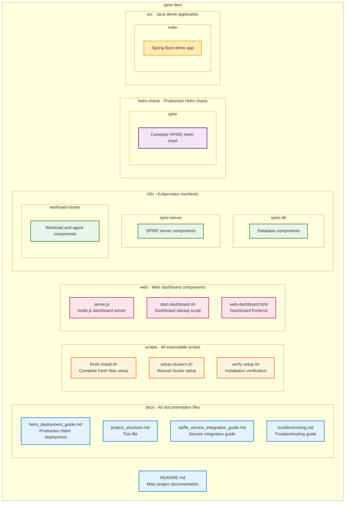

# SPIFFE/SPIRE Project Structure

This document outlines the organized structure of the SPIFFE/SPIRE local development environment.

## 📁 Repository Structure

## 🎯 Key Components

### **🚀 Entry Points**
- **`./scripts/fresh-install.sh`** - Main entry point for fresh Mac setup
- **`./web/start-dashboard.sh`** - Start real-time monitoring dashboard
- **`README.md`** - Primary documentation and getting started guide

### **📖 Documentation Strategy**
All documentation is centralized in the `docs/` directory:
- **Centralized location** for easy maintenance
- **Clear separation** from code and scripts
- **Linked from README** for discoverability

### **🔧 Scripts Organization**
All executable scripts are in the `scripts/` directory:
- **Consistent location** for all automation
- **Executable permissions** maintained
- **Interdependent scripts** in same location

### **🌐 Web Components**
Web-related files are isolated in the `web/` directory:
- **Self-contained** dashboard application
- **Isolated dependencies** (Node.js, etc.)
- **Clear separation** from infrastructure code

## 🔄 Workflow Patterns

### **Fresh Mac Setup**
1. `./scripts/fresh-install.sh` - Complete environment setup
2. `./web/start-dashboard.sh` - Start monitoring
3. Open `http://localhost:3000/web-dashboard.html`

### **Development Iteration**
1. Make changes to configurations
2. `./scripts/fresh-install.sh` - Reset to clean state
3. Test changes with dashboard

### **Production Deployment**
1. Review `docs/helm_deployment_guide.md`
2. Use Helm charts in `helm-charts/spire/`
3. Adapt configurations for production

## 📊 Best Practices Applied

### **Repository Organization**
- ✅ **Separation of concerns** - docs, scripts, web, k8s separated
- ✅ **Consistent naming** - kebab-case for files and directories
- ✅ **Logical grouping** - related files in same directories
- ✅ **Clear entry points** - obvious starting scripts

### **Documentation Strategy**
- ✅ **Single source of truth** - all docs in `docs/`
- ✅ **Cross-linked** - documents reference each other appropriately
- ✅ **Hierarchical** - README → specific guides
- ✅ **Practical focus** - emphasizes fresh Mac laptop workflow

### **Script Organization**
- ✅ **Executable permissions** maintained across moves
- ✅ **Relative path updates** for new structure
- ✅ **Consistent interfaces** - all scripts callable from project root
- ✅ **Clear dependencies** - scripts reference correct paths

### **Web Application Structure**
- ✅ **Self-contained** - all web files in dedicated directory
- ✅ **Proper path handling** - scripts work from any location
- ✅ **Clear entry point** - single startup script

## 🏢 Enterprise Considerations

This structure supports enterprise adoption by:
- **Clear separation** of development vs production components
- **Documented pathways** from local to enterprise deployment
- **Modular organization** for team collaboration
- **Best practices** that scale to larger projects

The organized structure makes it easy for teams to:
1. **Onboard new developers** with clear entry points
2. **Maintain documentation** in centralized location  
3. **Extend functionality** with consistent patterns
4. **Deploy to production** using organized Helm charts