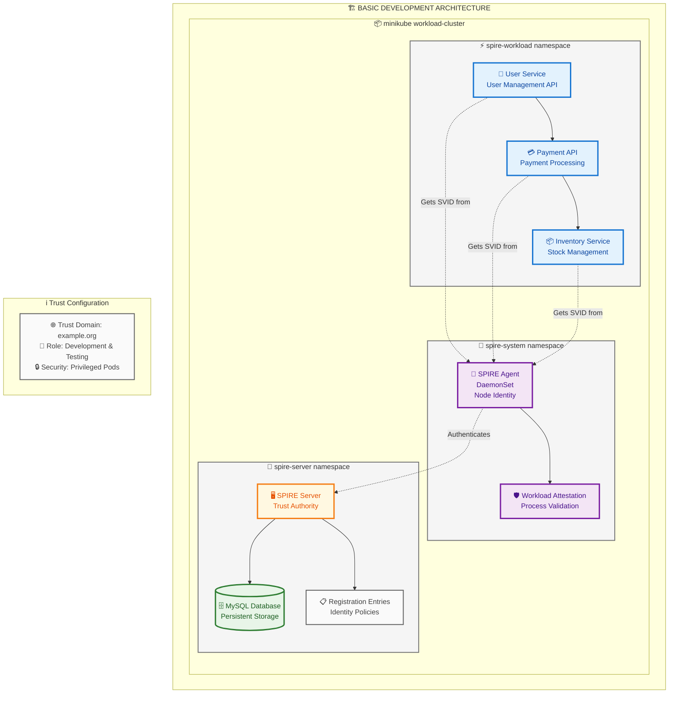
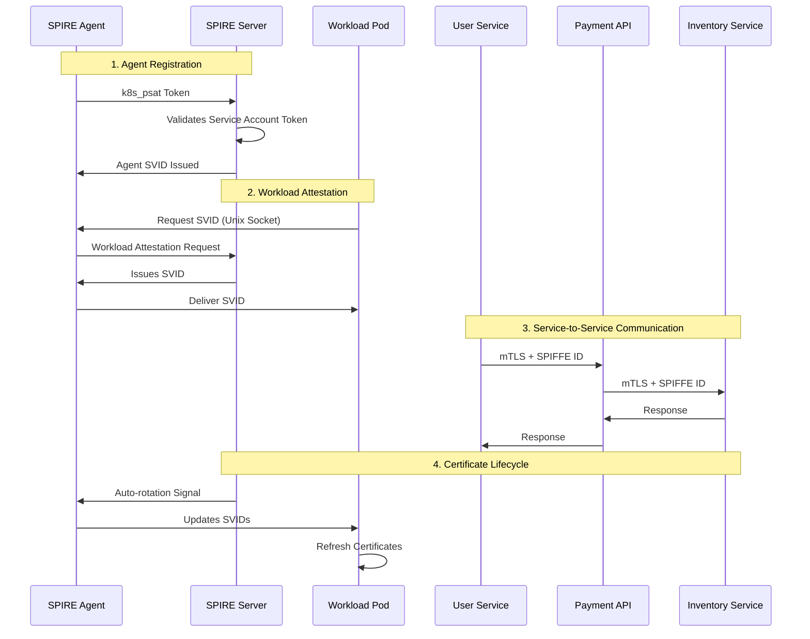
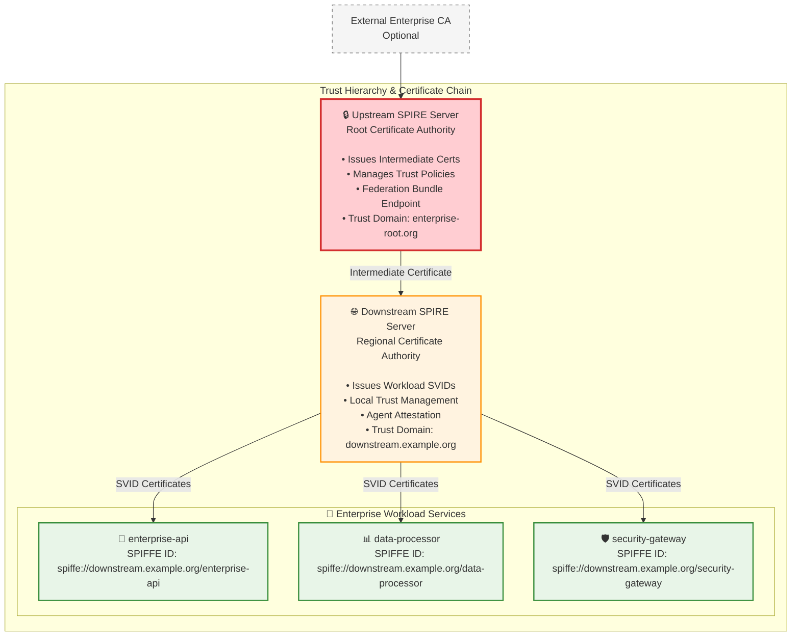
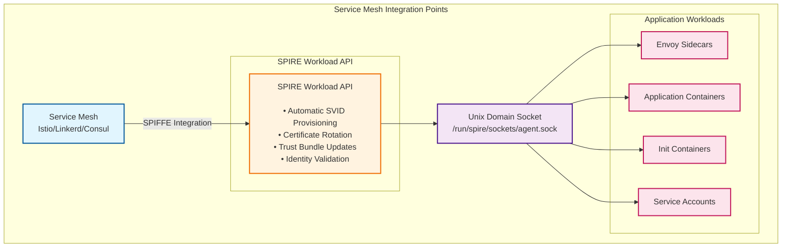
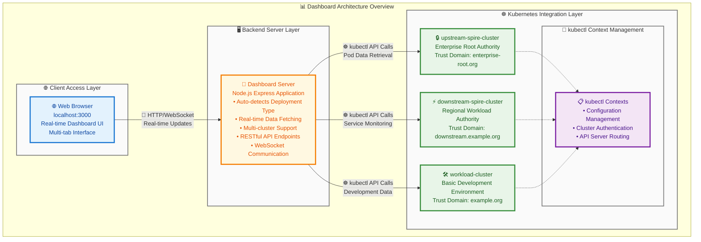
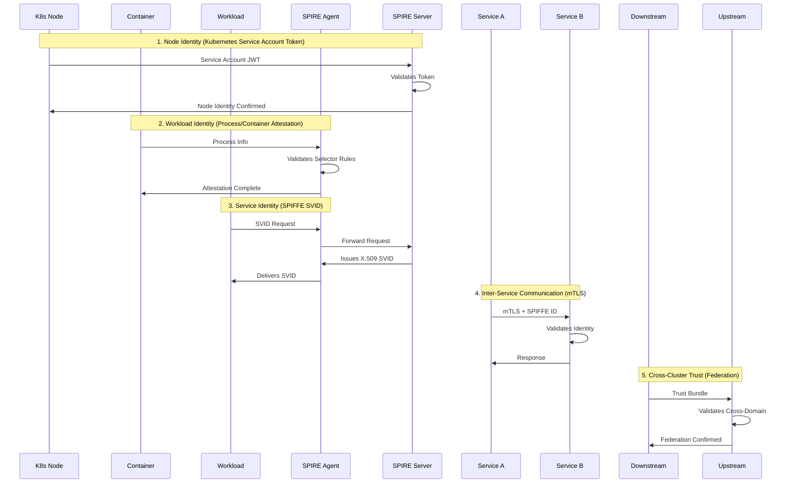

# SPIRE Architecture Diagrams

This document provides visual representations of both basic and enterprise SPIRE deployments available in this project.

## Basic Development Architecture

### Minikube Cluster Layout



### Component Interaction Flow



## Enterprise Multi-Cluster Architecture

### Upstream and Downstream Topology

```mermaid
graph TB
    subgraph ENTERPRISE["🏢 ENTERPRISE MULTI-CLUSTER ARCHITECTURE"]
        
        subgraph ROOT_AUTH["🔒 ENTERPRISE ROOT AUTHORITY"]
            subgraph UPSTREAM_CLUSTER["🔐 upstream-spire-cluster"]
                USS[🏛️ SPIRE Server<br/>Root Certificate Authority<br/>Trust Domain: enterprise-root.org]
                UDB[(🗄️ MySQL Database<br/>Root CA Storage<br/>Certificate Policies)]
                UFE[🌐 Federation Endpoint<br/>Trust Bundle Distribution<br/>Cross-Cluster Auth)]
                UCM[⚙️ Controller Manager<br/>Policy Enforcement<br/>Lifecycle Management]
                
                USS --> UDB
                USS --> UFE
                UCM --> USS
            end
        end
        
        subgraph REGIONAL_AUTH["⚡ REGIONAL/WORKLOAD AUTHORITY"]
            subgraph DOWNSTREAM_CLUSTER["🌐 downstream-spire-cluster"]
                DSS[🏢 SPIRE Server<br/>Regional Certificate Authority<br/>Trust Domain: downstream.example.org]
                DDB[(🗄️ MySQL Database<br/>Regional CA Storage<br/>Workload Identities)]
                DSA[🤖 SPIRE Agents<br/>DaemonSet<br/>Node Attestation]
                DCM[⚙️ Controller Manager<br/>Regional Policy Management]
                
                DSS --> DDB
                DCM --> DSS
                DSA --> DSS
            end
            
            subgraph CONTROL_PLANE["🔧 spire-downstream namespace"]
                CP[🔧 Control Plane<br/>Configuration Management]
                TB[🔗 Trust Bundle Management<br/>Federation State]
            end
            
            subgraph WORKLOADS["⚡ downstream-workloads namespace"] 
                EA[🏢 Enterprise API<br/>Business Logic Services<br/>Customer Management]
                DP[📊 Data Processor<br/>Analytics & Reporting<br/>Data Transformation]
                SG[🛡️ Security Gateway<br/>Access Control<br/>Traffic Management]
            end
            
            subgraph EXTERNAL["🌍 External Access Layer"]
                SGW[🔒 Security Gateway<br/>NodePort Service<br/>External Load Balancer]
                EXT[🌍 External Traffic<br/>Internet Ingress<br/>API Gateway]
                
                SGW --> EXT
            end
        end
    end
    
    %% Federation relationships
    UFE -.->|🔐 Trust Bundle Exchange<br/>Certificate Chain Validation| DSS
    DSS -.->|🔐 Cross-Domain Authentication<br/>Identity Federation| UFE
    
    %% Workload identity provisioning
    DSA -.->|🎟️ Issues SPIFFE SVIDs| EA
    DSA -.->|🎟️ Issues SPIFFE SVIDs| DP
    DSA -.->|🎟️ Issues SPIFFE SVIDs| SG
    
    %% External access flow
    SG --> SGW
    
    %% Enhanced styling with better contrast
    classDef upstreamStyle fill:#e3f2fd,stroke:#0d47a1,stroke-width:4px,color:#01579b
    classDef downstreamStyle fill:#f3e5f5,stroke:#4a148c,stroke-width:4px,color:#6a1b9a
    classDef serverStyle fill:#fff8e1,stroke:#f57c00,stroke-width:3px,color:#e65100
    classDef databaseStyle fill:#e8f5e8,stroke:#2e7d32,stroke-width:3px,color:#1b5e20
    classDef agentStyle fill:#fff3e0,stroke:#ef6c00,stroke-width:3px,color:#bf360c
    classDef workloadStyle fill:#fce4ec,stroke:#c2185b,stroke-width:3px,color:#880e4f
    classDef externalStyle fill:#f5f5f5,stroke:#424242,stroke-width:3px,color:#212121
    classDef namespaceStyle fill:#fafafa,stroke:#757575,stroke-width:2px
    
    class USS,DSS serverStyle
    class UDB,DDB databaseStyle
    class DSA,UCM,DCM agentStyle
    class EA,DP,SG workloadStyle
    class SGW,EXT,UFE externalStyle
    class CP,TB workloadStyle
    
    %% Cluster and namespace containers
    class UPSTREAM_CLUSTER upstreamStyle
    class DOWNSTREAM_CLUSTER,CONTROL_PLANE,WORKLOADS,EXTERNAL downstreamStyle
```

### Trust Hierarchy and Certificate Chain



## Minikube Cluster Details

### Basic Development Clusters

| Cluster | Profile | Resources | Purpose |
|---------|---------|-----------|---------|
| workload-cluster | Default | 2 CPU, 2GB RAM | Development and testing |

### Enterprise Clusters

| Cluster | Profile | Resources | Purpose |
|---------|---------|-----------|---------|
| upstream-spire-cluster | upstream-spire-cluster | 2 CPU, 3GB RAM | Root Certificate Authority |
| downstream-spire-cluster | downstream-spire-cluster | 2 CPU, 3GB RAM | Regional Authority + Workloads |

### Network Architecture

```mermaid
graph TB
    subgraph HOST["💻 Host Machine - macOS"]
        subgraph DOCKER["🐳 Docker Desktop Container Runtime"]
            
            subgraph UPSTREAM["🔒 upstream-spire-cluster"]
                subgraph UP_NS["🔐 spire-upstream namespace"]
                    USS_GRPC[🖥️ spire-upstream-server<br/>Port: 8081 (gRPC)<br/>Certificate Authority]
                    USS_FED[🌐 spire-upstream-server<br/>Port: 8443 (Federation)<br/>Trust Bundle Endpoint]  
                    USS_DB[🗄️ spire-upstream-db<br/>Port: 5432<br/>PostgreSQL Database]
                end
                
                subgraph UP_PORTS["🌍 NodePort Services"]
                    NP_31081[🔗 31081 → 8081<br/>External gRPC Access]
                    NP_31443[🔗 31443 → 8443<br/>External Federation]
                end
            end
            
            subgraph DOWNSTREAM["⚡ downstream-spire-cluster"]
                subgraph DOWN_NS["🔐 spire-downstream namespace"]
                    DSS_GRPC[🖥️ spire-downstream-server<br/>Port: 8081 (gRPC)<br/>Regional Authority]
                    DSS_FED[🌐 spire-downstream-server<br/>Port: 8443 (Federation)<br/>Trust Validation]
                    DSS_DB[🗄️ spire-downstream-db<br/>Port: 5432<br/>PostgreSQL Database]
                end
                
                subgraph DOWN_WL["⚡ downstream-workloads namespace"]
                    EA_SVC[🏢 enterprise-api<br/>Port: 80<br/>Business Logic API]
                    DP_SVC[📊 data-processor<br/>Port: 80<br/>Data Processing Service]
                    SG_SVC[🛡️ security-gateway<br/>Port: 8080<br/>Security Gateway]
                end
                
                subgraph DOWN_PORTS["🌍 NodePort Services"]
                    NP_32081[🔗 32081 → 8081<br/>External gRPC Access]
                    NP_32443[🔗 32443 → 8443<br/>External Federation]
                    NP_30080[🔗 30080 → 8080<br/>External Gateway Access]
                end
            end
        end
        
        subgraph DASHBOARD["🖥️ Management Interface"]
            DASH[📊 Dashboard Server<br/>localhost:3000<br/>Enterprise Monitoring<br/>Multi-cluster Management]
        end
    end
    
    %% Internal service connections
    USS_GRPC --> NP_31081
    USS_FED --> NP_31443
    DSS_GRPC --> NP_32081
    DSS_FED --> NP_32443
    SG_SVC --> NP_30080
    
    %% Cross-cluster federation
    USS_FED -.->|🔐 Trust Bundle Exchange| DSS_FED
    DSS_FED -.->|🔐 Certificate Validation| USS_FED
    
    %% Dashboard monitoring connections
    DASH -.->|📈 kubectl API Monitoring| UPSTREAM
    DASH -.->|📈 kubectl API Monitoring| DOWNSTREAM
    
    %% Enhanced styling
    classDef serverStyle fill:#fff3e0,stroke:#f57c00,stroke-width:3px,color:#e65100
    classDef databaseStyle fill:#e8f5e8,stroke:#388e3c,stroke-width:3px,color:#1b5e20
    classDef serviceStyle fill:#e3f2fd,stroke:#1976d2,stroke-width:3px,color:#0d47a1
    classDef nodeportStyle fill:#fce4ec,stroke:#c2185b,stroke-width:3px,color:#880e4f
    classDef dashboardStyle fill:#f3e5f5,stroke:#7b1fa2,stroke-width:3px,color:#4a148c
    classDef namespaceStyle fill:#f8f9fa,stroke:#6c757d,stroke-width:2px
    classDef clusterStyle fill:#fff8e1,stroke:#ff8f00,stroke-width:2px
    
    class USS_GRPC,USS_FED,DSS_GRPC,DSS_FED serverStyle
    class USS_DB,DSS_DB databaseStyle
    class EA_SVC,DP_SVC,SG_SVC serviceStyle
    class NP_31081,NP_31443,NP_32081,NP_32443,NP_30080 nodeportStyle
    class DASH dashboardStyle
    
    %% Container and namespace styling  
    class UP_NS,DOWN_NS,DOWN_WL,UP_PORTS,DOWN_PORTS namespaceStyle
    class UPSTREAM,DOWNSTREAM clusterStyle
```

## Service Mesh Integration Points

### SPIFFE Integration Locations



## Monitoring and Observability

### Dashboard Architecture



## Security Architecture

### Identity and Access Flow



---

These diagrams provide a comprehensive view of the SPIRE architecture implementations available in this project, from basic development setups to enterprise-grade multi-cluster deployments.