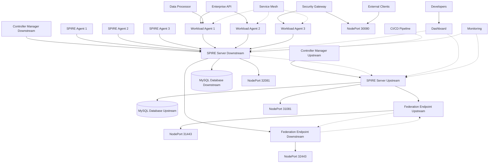
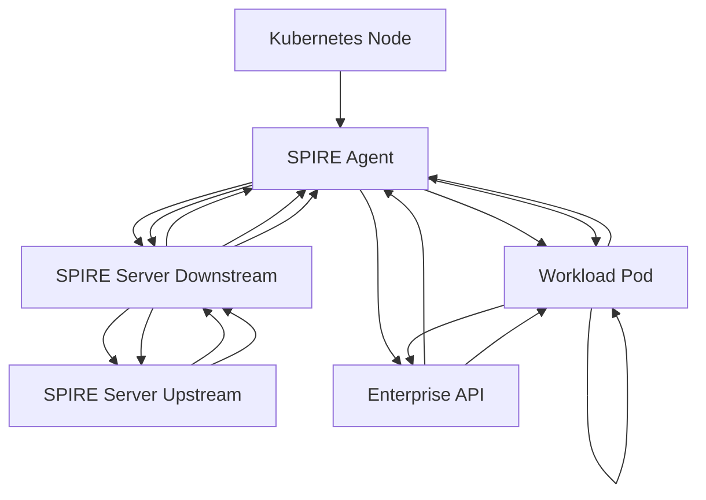
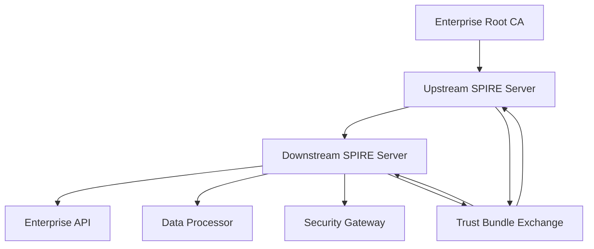
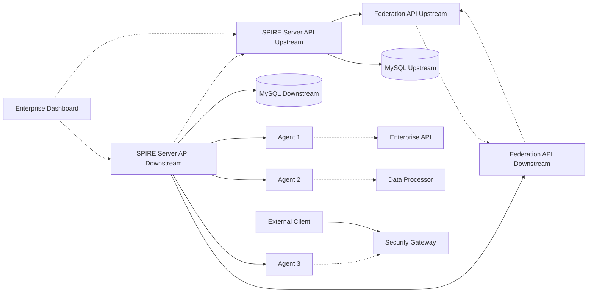

# Enterprise SPIRE Architecture Diagram

This document provides detailed diagrams of the enterprise SPIRE deployment architecture, showing the relationship between SPIRE servers, agents, databases, and workloads across upstream and downstream clusters.

> **⚠️ Prerequisites**: This architecture is created by running:
> ```bash
> ./scripts/fresh-install.sh enterprise
> ```
> **Clusters created**: `upstream-spire-cluster` + `downstream-spire-cluster`

## Enterprise Multi-Cluster Architecture



## Component Interaction Flow



## Trust Domain Architecture



## Data Flow Architecture



## Kubernetes Resource Architecture

```mermaid
graph TB
    U_NS[Namespace spire-upstream]
    U_SS[StatefulSet spire-upstream-server]
    U_SVC[Service spire-upstream-server]
    U_CM[ConfigMap spire-upstream-server-config]
    U_SA[ServiceAccount spire-upstream-server]
    U_CR[ClusterRole spire-upstream-server-role]
    U_CRB[ClusterRoleBinding spire-upstream-server-binding]
    U_DEP[Deployment spire-upstream-db]
    U_PVC[PVC spire-upstream-db-pvc]
    
    D_NS[Namespace spire-downstream]
    D_SS[StatefulSet spire-downstream-server]
    D_SVC[Service spire-downstream-server]
    D_CM[ConfigMap spire-downstream-server-config]
    D_SA[ServiceAccount spire-downstream-server]
    D_CR[ClusterRole spire-downstream-server-role]
    D_CRB[ClusterRoleBinding spire-downstream-server-binding]
    D_DEP[Deployment spire-downstream-db]
    D_PVC[PVC spire-downstream-db-pvc]
    D_DS[DaemonSet spire-downstream-agent]
    
    W_NS[Namespace downstream-workloads]
    W_DS[DaemonSet spire-downstream-agent]
    W_DEP1[Deployment enterprise-api]
    W_DEP2[Deployment data-processor] 
    W_DEP3[Deployment security-gateway]
    W_SVC1[Service enterprise-api]
    W_SVC2[Service data-processor]
    W_SVC3[Service security-gateway]
    W_SA[ServiceAccount spire-downstream-agent]
    
    U_NS --> U_SS
    U_NS --> U_SVC
    U_NS --> U_CM
    U_NS --> U_SA
    U_NS --> U_DEP
    U_NS --> U_PVC
    U_SA --> U_CR
    U_CR --> U_CRB
    U_SS --> U_CM
    U_SS --> U_SA
    U_DEP --> U_PVC
    
    D_NS --> D_SS
    D_NS --> D_SVC
    D_NS --> D_CM
    D_NS --> D_SA
    D_NS --> D_DEP
    D_NS --> D_PVC
    D_NS --> D_DS
    D_SA --> D_CR
    D_CR --> D_CRB
    D_SS --> D_CM
    D_SS --> D_SA
    D_DEP --> D_PVC
    D_DS --> D_SA
    
    W_NS --> W_DS
    W_NS --> W_DEP1
    W_NS --> W_DEP2
    W_NS --> W_DEP3
    W_NS --> W_SVC1
    W_NS --> W_SVC2
    W_NS --> W_SVC3
    W_NS --> W_SA
    W_DS --> W_SA
    W_DEP1 --> W_SVC1
    W_DEP2 --> W_SVC2
    W_DEP3 --> W_SVC3
```

