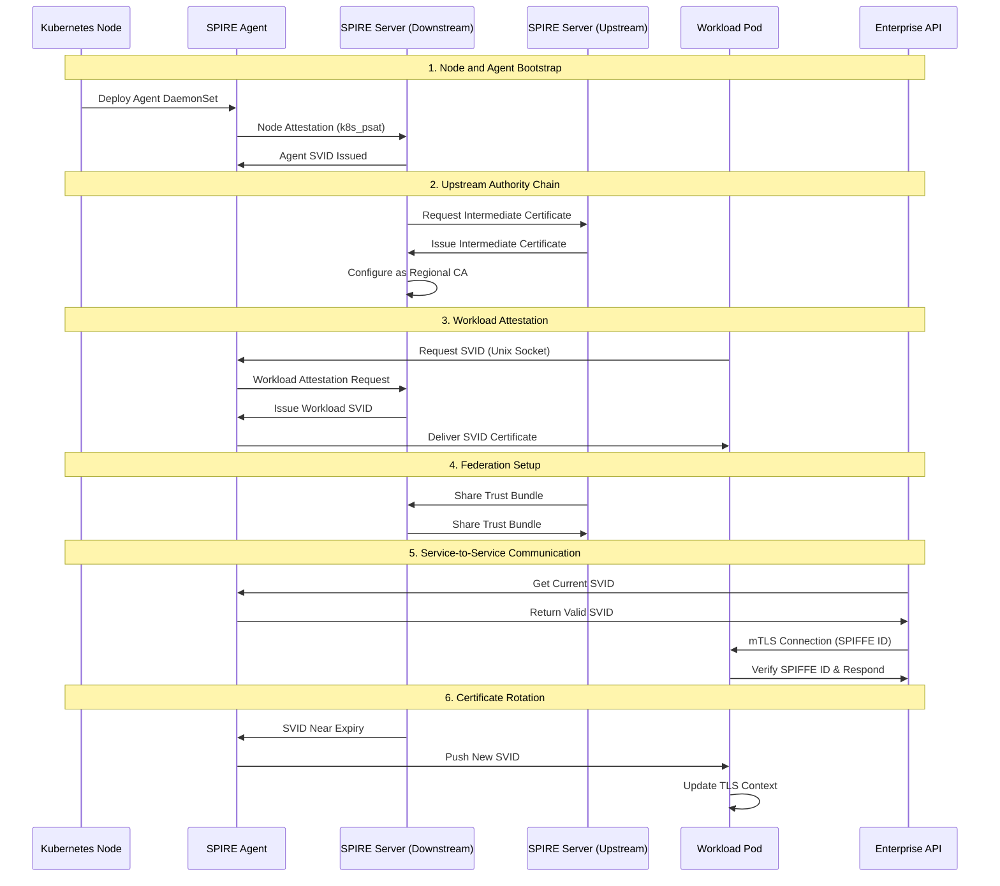

# Enterprise SPIRE Architecture Diagram

This document provides a detailed Mermaid diagram of the enterprise SPIRE deployment architecture, showing the relationship between SPIRE servers, agents, databases, and workloads across upstream and downstream clusters.

## Enterprise Multi-Cluster Architecture

```mermaid
graph TB
    subgraph "🏢 ENTERPRISE SPIRE DEPLOYMENT"
        subgraph "🔒 UPSTREAM CLUSTER (Root CA)"
            subgraph "upstream-spire-cluster"
                subgraph "spire-upstream namespace"
                    US[🔐 SPIRE Server<br/>enterprise-root.org<br/>Port: 8081]
                    UDB[(🗃️ MySQL<br/>Database<br/>Port: 3306)]
                    UCM[⚙️ Controller Manager<br/>K8s Integration]
                    UFE[🌐 Federation Endpoint<br/>Port: 8443]
                    
                    US --> UDB
                    US --> UFE
                    UCM --> US
                end
                
                subgraph "Upstream Services"
                    UNP[NodePort 31081<br/>External Access]
                    UNFP[NodePort 31443<br/>Federation Access]
                end
                
                US --> UNP
                UFE --> UNFP
            end
        end
        
        subgraph "🌐 DOWNSTREAM CLUSTER (Regional)"
            subgraph "downstream-spire-cluster"
                subgraph "spire-downstream namespace"
                    DS[🔐 SPIRE Server<br/>downstream.example.org<br/>Port: 8081]
                    DDB[(🗃️ MySQL<br/>Database<br/>Port: 3306)]
                    DCM[⚙️ Controller Manager<br/>K8s Integration]
                    DFE[🌐 Federation Endpoint<br/>Port: 8443]
                    
                    DS --> DDB
                    DS --> DFE
                    DCM --> DS
                end
                
                subgraph "spire-downstream namespace (Agents)"
                    DA1[🤖 SPIRE Agent<br/>Node 1<br/>DaemonSet]
                    DA2[🤖 SPIRE Agent<br/>Node 2<br/>DaemonSet]
                    DA3[🤖 SPIRE Agent<br/>Node N<br/>DaemonSet]
                end
                
                subgraph "downstream-workloads namespace"
                    WDA1[🤖 SPIRE Agent<br/>Workload Node 1<br/>DaemonSet]
                    WDA2[🤖 SPIRE Agent<br/>Workload Node 2<br/>DaemonSet]
                    WDA3[🤖 SPIRE Agent<br/>Workload Node N<br/>DaemonSet]
                    
                    subgraph "Enterprise Workloads"
                        EA[🏢 Enterprise API<br/>Port: 80<br/>Replicas: 2]
                        DP[📊 Data Processor<br/>Port: 80<br/>Replicas: 1]
                        SG[🛡️ Security Gateway<br/>Port: 8080<br/>Envoy Proxy]
                    end
                end
                
                subgraph "Downstream Services"
                    DNP[NodePort 32081<br/>External Access]
                    DNFP[NodePort 32443<br/>Federation Access]
                    DSGP[NodePort 30080<br/>Gateway Access]
                end
                
                DS --> DNP
                DFE --> DNFP
                SG --> DSGP
                
                %% Agent connections to server
                DA1 --> DS
                DA2 --> DS
                DA3 --> DS
                WDA1 --> DS
                WDA2 --> DS
                WDA3 --> DS
                
                %% Workload connections to agents
                EA --> WDA1
                EA --> WDA2
                DP --> WDA1
                SG --> WDA3
            end
        end
    end
    
    %% Federation relationship
    UFE -.->|Trust Bundle Exchange<br/>Federation| DFE
    DFE -.->|Trust Bundle Exchange<br/>Federation| UFE
    
    %% Upstream authority relationship
    DS -.->|Certificate Signing<br/>Upstream Authority| US
    
    %% External connections
    subgraph "🌍 External Access"
        EXT[External Clients]
        DEV[Developers]
        DASH[📊 Dashboard<br/>localhost:3000]
    end
    
    EXT --> DSGP
    DEV --> DASH
    DASH -.->|kubectl API| upstream-spire-cluster
    DASH -.->|kubectl API| downstream-spire-cluster
    
    %% Service mesh integration points
    subgraph "🔗 Integration Points"
        SM[Service Mesh<br/>(Istio/Linkerd)]
        CI[CI/CD Pipeline]
        MON[Monitoring<br/>(Prometheus)]
    end
    
    SM -.->|SPIFFE Integration| WDA1
    SM -.->|SPIFFE Integration| WDA2
    SM -.->|SPIFFE Integration| WDA3
    CI -.->|Workload Registration| DS
    MON -.->|Metrics Collection| US
    MON -.->|Metrics Collection| DS

    %% Consistent styling with proper border alignment
    classDef upstreamCluster fill:#e1f5fe,stroke:#01579b,stroke-width:3px,stroke-dasharray:0
    classDef downstreamCluster fill:#f3e5f5,stroke:#4a148c,stroke-width:3px,stroke-dasharray:0
    classDef spireServer fill:#ffecb3,stroke:#ff8f00,stroke-width:2px,stroke-dasharray:0
    classDef database fill:#e8f5e8,stroke:#2e7d32,stroke-width:2px,stroke-dasharray:0
    classDef agent fill:#fff3e0,stroke:#ef6c00,stroke-width:2px,stroke-dasharray:0
    classDef workload fill:#fce4ec,stroke:#c2185b,stroke-width:2px,stroke-dasharray:0
    classDef external fill:#f5f5f5,stroke:#424242,stroke-width:2px,stroke-dasharray:0
    
    class US,DS spireServer
    class UDB,DDB database
    class DA1,DA2,DA3,WDA1,WDA2,WDA3 agent
    class EA,DP,SG workload
    class EXT,DEV,DASH,SM,CI,MON external
```

## Component Interaction Flow



## Trust Domain Architecture

```mermaid
graph TD
    subgraph "Trust Hierarchy"
        ROOT[🔒 Enterprise Root CA<br/>enterprise-root.org]
        
        subgraph "Upstream Trust Domain"
            US_TD[🏢 Upstream SPIRE Server<br/>Trust Domain: enterprise-root.org<br/>Role: Root Certificate Authority]
        end
        
        subgraph "Downstream Trust Domain"  
            DS_TD[🌐 Downstream SPIRE Server<br/>Trust Domain: downstream.example.org<br/>Role: Regional Certificate Authority]
            
            subgraph "Workload Identities"
                EA_ID[🏢 Enterprise API<br/>spiffe://downstream.example.org/enterprise-api]
                DP_ID[📊 Data Processor<br/>spiffe://downstream.example.org/data-processor]
                SG_ID[🛡️ Security Gateway<br/>spiffe://downstream.example.org/security-gateway]
            end
        end
        
        subgraph "Federation"
            FB[🤝 Trust Bundle Exchange<br/>Cross-Domain Authentication]
        end
    end
    
    ROOT --> US_TD
    US_TD --> DS_TD
    DS_TD --> EA_ID
    DS_TD --> DP_ID  
    DS_TD --> SG_ID
    US_TD <--> FB
    DS_TD <--> FB
    
    classDef rootCA fill:#ffcdd2,stroke:#d32f2f,stroke-width:3px,stroke-dasharray:0
    classDef intermediate fill:#fff3e0,stroke:#ff8f00,stroke-width:2px,stroke-dasharray:0
    classDef workloadId fill:#e8f5e8,stroke:#388e3c,stroke-width:2px,stroke-dasharray:0
    classDef federation fill:#e3f2fd,stroke:#1976d2,stroke-width:2px,stroke-dasharray:0
    
    class ROOT rootCA
    class US_TD,DS_TD intermediate
    class EA_ID,DP_ID,SG_ID workloadId
    class FB federation
```



## Data Flow Architecture

```mermaid
graph LR
    subgraph "🔒 Upstream Cluster"
        US_API[SPIRE Server API<br/>:8081]
        US_FED[Federation API<br/>:8443]
        US_DB[(MySQL<br/>Registration Data)]
        
        US_API --> US_DB
        US_API --> US_FED
    end
    
    subgraph "🌐 Downstream Cluster"
        DS_API[SPIRE Server API<br/>:8081]
        DS_FED[Federation API<br/>:8443]
        DS_DB[(MySQL<br/>Registration Data)]
        
        DS_API --> DS_DB
        DS_API --> DS_FED
        
        subgraph "Agent Network"
            AG1[Agent 1<br/>Unix Socket]
            AG2[Agent 2<br/>Unix Socket]
            AG3[Agent N<br/>Unix Socket]
        end
        
        subgraph "Workload Network"
            WL1[Enterprise API<br/>:80]
            WL2[Data Processor<br/>:80]
            WL3[Security Gateway<br/>:8080]
        end
        
        DS_API --> AG1
        DS_API --> AG2
        DS_API --> AG3
        
        AG1 -.->|Unix Socket<br/>/run/spire/sockets/agent.sock| WL1
        AG2 -.->|Unix Socket<br/>/run/spire/sockets/agent.sock| WL2
        AG3 -.->|Unix Socket<br/>/run/spire/sockets/agent.sock| WL3
    end
    
    %% Cross-cluster communication
    US_FED <-.->|HTTPS<br/>Trust Bundle Sync| DS_FED
    DS_API -.->|gRPC<br/>Certificate Signing| US_API
    
    %% External access
    subgraph "🌍 External"
        CLIENT[External Client]
        DASHBOARD[Enterprise Dashboard]
    end
    
    CLIENT --> WL3
    DASHBOARD -.->|kubectl API| US_API
    DASHBOARD -.->|kubectl API| DS_API
    
    classDef server fill:#ffecb3,stroke:#ff8f00,stroke-width:2px,stroke-dasharray:0
    classDef database fill:#e8f5e8,stroke:#2e7d32,stroke-width:2px,stroke-dasharray:0
    classDef agent fill:#fff3e0,stroke:#ef6c00,stroke-width:2px,stroke-dasharray:0
    classDef workload fill:#fce4ec,stroke:#c2185b,stroke-width:2px,stroke-dasharray:0
    classDef external fill:#f5f5f5,stroke:#424242,stroke-width:2px,stroke-dasharray:0
    
    class US_API,DS_API,US_FED,DS_FED server
    class US_DB,DS_DB database
    class AG1,AG2,AG3 agent
    class WL1,WL2,WL3 workload
    class CLIENT,DASHBOARD external
```



## Kubernetes Resource Architecture

```mermaid
graph TB
    subgraph "📦 Kubernetes Resources"
        subgraph "🔒 Upstream Cluster (upstream-spire-cluster)"
            subgraph "spire-upstream namespace"
                U_NS[Namespace: spire-upstream]
                U_SS[StatefulSet: spire-upstream-server]
                U_SVC[Service: spire-upstream-server]
                U_CM[ConfigMap: spire-upstream-server-config]
                U_SA[ServiceAccount: spire-upstream-server]
                U_CR[ClusterRole: spire-upstream-server-role]
                U_CRB[ClusterRoleBinding: spire-upstream-server-binding]
                U_DEP[Deployment: spire-upstream-db]
                U_PVC[PVC: spire-upstream-db-pvc]
                
                U_NS --> U_SS
                U_NS --> U_SVC
                U_NS --> U_CM
                U_NS --> U_SA
                U_NS --> U_DEP
                U_NS --> U_PVC
                U_SA --> U_CR
                U_CR --> U_CRB
                U_SS --> U_CM
                U_SS --> U_SA
                U_DEP --> U_PVC
            end
        end
        
        subgraph "🌐 Downstream Cluster (downstream-spire-cluster)"
            subgraph "spire-downstream namespace"
                D_NS[Namespace: spire-downstream]
                D_SS[StatefulSet: spire-downstream-server]
                D_SVC[Service: spire-downstream-server]
                D_CM[ConfigMap: spire-downstream-server-config]
                D_SA[ServiceAccount: spire-downstream-server]
                D_CR[ClusterRole: spire-downstream-server-role]
                D_CRB[ClusterRoleBinding: spire-downstream-server-binding]
                D_DEP[Deployment: spire-downstream-db]
                D_PVC[PVC: spire-downstream-db-pvc]
                D_DS[DaemonSet: spire-downstream-agent]
                
                D_NS --> D_SS
                D_NS --> D_SVC
                D_NS --> D_CM
                D_NS --> D_SA
                D_NS --> D_DEP
                D_NS --> D_PVC
                D_NS --> D_DS
                D_SA --> D_CR
                D_CR --> D_CRB
                D_SS --> D_CM
                D_SS --> D_SA
                D_DEP --> D_PVC
                D_DS --> D_SA
            end
            
            subgraph "downstream-workloads namespace"
                W_NS[Namespace: downstream-workloads]
                W_DS[DaemonSet: spire-downstream-agent]
                W_DEP1[Deployment: enterprise-api]
                W_DEP2[Deployment: data-processor] 
                W_DEP3[Deployment: security-gateway]
                W_SVC1[Service: enterprise-api]
                W_SVC2[Service: data-processor]
                W_SVC3[Service: security-gateway]
                W_SA[ServiceAccount: spire-downstream-agent]
                
                W_NS --> W_DS
                W_NS --> W_DEP1
                W_NS --> W_DEP2
                W_NS --> W_DEP3
                W_NS --> W_SVC1
                W_NS --> W_SVC2
                W_NS --> W_SVC3
                W_NS --> W_SA
                W_DS --> W_SA
                W_DEP1 --> W_SVC1
                W_DEP2 --> W_SVC2
                W_DEP3 --> W_SVC3
            end
        end
    end
    
    classDef namespace fill:#e1f5fe,stroke:#01579b,stroke-width:3px,stroke-dasharray:0
    classDef workload fill:#fff3e0,stroke:#ef6c00,stroke-width:2px,stroke-dasharray:0
    classDef service fill:#e8f5e8,stroke:#2e7d32,stroke-width:2px,stroke-dasharray:0
    classDef config fill:#f3e5f5,stroke:#4a148c,stroke-width:2px,stroke-dasharray:0
    classDef security fill:#ffecb3,stroke:#ff8f00,stroke-width:2px,stroke-dasharray:0
    
    class U_NS,D_NS,W_NS namespace
    class U_SS,U_DEP,D_SS,D_DEP,D_DS,W_DS,W_DEP1,W_DEP2,W_DEP3 workload
    class U_SVC,D_SVC,W_SVC1,W_SVC2,W_SVC3 service
    class U_CM,D_CM,U_PVC,D_PVC config
    class U_SA,U_CR,U_CRB,D_SA,D_CR,D_CRB,W_SA security
```

