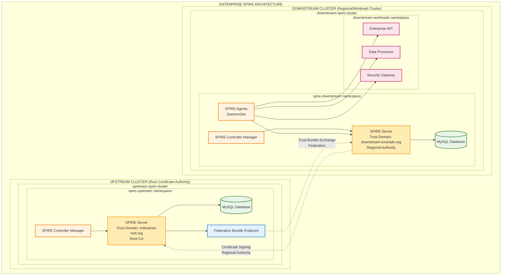
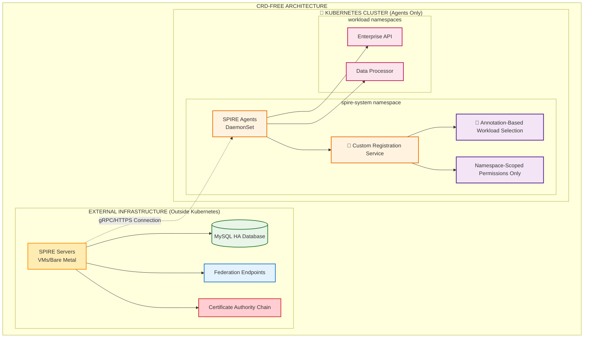

# SPIRE Enterprise Deployment Guide

This guide demonstrates a production-ready enterprise SPIRE deployment with upstream and downstream clusters, implementing a hierarchical trust architecture suitable for large-scale organizations.

## Architecture Overview

### Enterprise Multi-Cluster Architecture



### Trust Hierarchy

1. **Upstream Cluster** (`enterprise-root.org`)
   - Acts as the Root Certificate Authority
   - Issues intermediate certificates to downstream clusters
   - Manages enterprise-wide trust policies
   - Operates federation bundle endpoint

2. **Downstream Cluster** (`downstream.example.org`) 
   - Regional certificate authority
   - Manages workload identities within its trust domain
   - Federates with upstream for cross-domain trust
   - Hosts enterprise application workloads

## Quick Start

### Prerequisites

- minikube installed and configured
- kubectl configured 
- Node.js for dashboard
- Docker for container runtime

### Deployment Options

#### Option 1: Full Enterprise Setup (Requires CRDs)

```bash
# Deploy enterprise architecture with CRDs
./scripts/fresh-install.sh enterprise

# Or step-by-step setup
./scripts/setup-enterprise-clusters.sh

# Verify deployment
./scripts/verify-enterprise-setup.sh
```

#### Option 2: CRD-Free Enterprise Setup

```bash
# Deploy enterprise architecture without CRDs
./scripts/setup-crd-free-deployment.sh

# This approach uses:
# - External SPIRE servers (outside Kubernetes)
# - Agent-only Kubernetes deployment
# - Annotation-based workload registration
# - No cluster-wide privileges required
```

### Dashboard Access

```bash
# Start enterprise dashboard (auto-detects deployment type)
./web/start-dashboard.sh
```

### Access Dashboard

```bash
# Auto-detected enterprise dashboard
open http://localhost:3000/web-dashboard.html
```

## Detailed Setup Instructions

### 1. Deploy Upstream Cluster (Root CA)

The upstream cluster serves as the root certificate authority for the enterprise:

```bash
# Create upstream cluster
minikube start -p upstream-spire-cluster --memory=3072 --cpus=2

# Deploy upstream components
kubectl --context upstream-spire-cluster apply -f k8s/upstream-cluster/
```

**Upstream Components:**
- `spire-upstream-server`: Root SPIRE server
- `spire-upstream-db`: MySQL database
- `spire-upstream-controller-manager`: Kubernetes integration

### 2. Deploy Downstream Cluster (Regional)

The downstream cluster operates as a regional authority:

```bash
# Create downstream cluster  
minikube start -p downstream-spire-cluster --memory=3072 --cpus=2

# Deploy downstream components
kubectl --context downstream-spire-cluster apply -f k8s/downstream-cluster/
```

**Downstream Components:**
- `spire-downstream-server`: Regional SPIRE server
- `spire-downstream-db`: MySQL database
- `spire-downstream-agent`: SPIRE agents (DaemonSet)
- Enterprise workload services

### 3. Configure Federation

Federation enables secure communication between trust domains:

```bash
# Extract trust bundles from both clusters
kubectl --context upstream-spire-cluster -n spire-upstream exec spire-upstream-server-0 -- \
    /opt/spire/bin/spire-server bundle show -format pem > upstream-bundle.pem

kubectl --context downstream-spire-cluster -n spire-downstream exec spire-downstream-server-0 -- \
    /opt/spire/bin/spire-server bundle show -format pem > downstream-bundle.pem

# Update ConfigMaps with trust bundles
kubectl --context upstream-spire-cluster -n spire-upstream \
    create configmap spire-bundle --from-file=bundle.crt=upstream-bundle.pem --dry-run=client -o yaml | kubectl apply -f -

kubectl --context downstream-spire-cluster -n spire-downstream \
    create configmap spire-bundle --from-file=bundle.crt=downstream-bundle.pem --dry-run=client -o yaml | kubectl apply -f -
```

## Enterprise Workload Services

### Example Services Deployed

1. **Enterprise API** (`enterprise-api`)
   - Primary business API service
   - Receives SPIFFE identity from SPIRE agent
   - Communicates with other services using mTLS

2. **Data Processor** (`data-processor`)
   - Backend data processing service
   - Attested by SPIRE for secure access
   - Processes sensitive enterprise data

3. **Security Gateway** (`security-gateway`)
   - Envoy-based ingress gateway
   - Enforces SPIFFE-based authentication
   - Exposed via NodePort for external access

### Accessing Services

```bash
# Port forward to security gateway
kubectl --context downstream-spire-cluster port-forward -n downstream-workloads \
    svc/security-gateway 30080:8080

# Access enterprise services
curl http://localhost:30080
```

## Configuration Details

### Upstream Server Configuration

Key configuration elements for the upstream server:

```yaml
server {
  trust_domain = "enterprise-root.org"
  # Root CA configuration
}

plugins {
  # Connects to external enterprise CA (in production)
  UpstreamAuthority "spiffe" {
    plugin_data {
      trust_domain = "enterprise-root.org"
      server_address = "upstream-ca.enterprise.com"
    }
  }
}

# Federation configuration
federation {
  bundle_endpoint {
    address = "0.0.0.0"
    port = 8443
  }
  federates_with "downstream.example.org" {
    bundle_endpoint_url = "https://spire-downstream-server.spire-downstream:8443"
  }
}
```

### Downstream Server Configuration

```yaml
server {
  trust_domain = "downstream.example.org"
  # Regional server configuration
}

plugins {
  # Connects to upstream SPIRE server
  UpstreamAuthority "spiffe" {
    plugin_data {
      server_address = "spire-upstream-server-external.spire-upstream"
      server_port = "8081"
      server_id = "spiffe://enterprise-root.org/spire/server"
    }
  }
}

# Federation with upstream
federation {
  federates_with "enterprise-root.org" {
    bundle_endpoint_url = "https://spire-upstream-server-external.spire-upstream:8443"
  }
}
```

## Verification Commands

### Check Cluster Status

```bash
# Upstream cluster
kubectl --context upstream-spire-cluster -n spire-upstream get pods
kubectl --context upstream-spire-cluster -n spire-upstream get svc

# Downstream cluster  
kubectl --context downstream-spire-cluster -n spire-downstream get pods
kubectl --context downstream-spire-cluster -n downstream-workloads get pods
```

### Test SPIRE Server APIs

```bash
# Test upstream server
kubectl --context upstream-spire-cluster -n spire-upstream exec spire-upstream-server-0 -- \
    /opt/spire/bin/spire-server bundle show

# Test downstream server
kubectl --context downstream-spire-cluster -n spire-downstream exec spire-downstream-server-0 -- \
    /opt/spire/bin/spire-server bundle show

# List registered agents
kubectl --context downstream-spire-cluster -n spire-downstream exec spire-downstream-server-0 -- \
    /opt/spire/bin/spire-server agent list
```

### Verify Federation

```bash
# Check trust bundle federation
kubectl --context upstream-spire-cluster -n spire-upstream get configmap spire-bundle -o yaml
kubectl --context downstream-spire-cluster -n spire-downstream get configmap spire-bundle -o yaml
```

## Enterprise Dashboard Features

The enterprise dashboard provides:

### Multi-Cluster Visualization
- **Upstream Cluster View**: Root CA status and health
- **Downstream Cluster View**: Regional services and workloads
- **Real-time Updates**: Pod status, health indicators

### Enterprise Metrics
- **Trust Domain Health**: Cross-cluster trust status
- **Workload Attestation**: Service identity verification
- **Federation Status**: Inter-cluster communication

### Access Dashboard

```bash
# Auto-detected enterprise mode
./web/start-dashboard.sh

# Direct URL
open http://localhost:3000/web-dashboard.html
```

## CRD-Free Enterprise Deployment

### Overview

For enterprises with strict CRD and elevated privilege restrictions, SPIRE can be deployed without Custom Resource Definitions using an external service pattern.

### Architecture Components



### CRD-Free Deployment Steps

#### 1. Deploy External SPIRE Infrastructure

```bash
# This would typically be done outside Kubernetes
# Example using VMs or bare metal servers

# Deploy SPIRE Server with HA database
docker run -d --name spire-server \
  -p 8081:8081 -p 8443:8443 \
  -v /opt/spire/config:/opt/spire/conf \
  -v /opt/spire/data:/opt/spire/data \
  ghcr.io/spiffe/spire-server:1.9.0 \
  -config /opt/spire/conf/server.conf

# Configure with external MySQL
# Set up federation endpoints
# Configure trust domain hierarchy
```

#### 2. Deploy Agent-Only Kubernetes Components

```bash
# Deploy SPIRE agents without CRDs
kubectl apply -f k8s/crd-free-deployment/agent-only-deployment.yaml

# Deploy custom registration service
kubectl apply -f k8s/crd-free-deployment/external-registration-service.yaml

# Deploy example workloads with annotations
kubectl apply -f k8s/crd-free-deployment/workload-examples.yaml
```

#### 3. Configure Annotation-Based Registration

Workloads use annotations instead of CRDs for identity specification:

```yaml
apiVersion: apps/v1
kind: Deployment
metadata:
  name: enterprise-api
spec:
  template:
    metadata:
      annotations:
        # CRD-free workload registration
        spire.io/spiffe-id: "spiffe://company.com/enterprise-api"
        spire.io/parent-id: "spiffe://company.com/spire/agent/k8s_psat/cluster/k8s-cluster"
        spire.io/selector: "k8s:pod-label:app:enterprise-api"
        spire.io/dns-names: "enterprise-api.production.svc.cluster.local"
```

### Benefits of CRD-Free Approach

✅ **Enterprise Policy Compliance**
- No CRDs installation required
- No cluster-wide privileges needed
- Namespace-scoped permissions only
- Compliance with SOX, PCI-DSS, FedRAMP requirements

✅ **Security Advantages**
- External SPIRE servers reduce Kubernetes attack surface
- Centralized certificate authority management
- Network isolation between control and data planes
- Reduced privilege escalation risks

✅ **Operational Benefits**
- Existing enterprise SPIRE infrastructure integration
- Familiar VM/bare metal operational procedures
- Centralized monitoring and management
- Standard enterprise backup/recovery processes

### Limitations and Considerations

⚠️ **Functional Limitations**
- Reduced Kubernetes-native automation
- Manual workload registration processes
- Limited federation automation
- Custom development for registration service

⚠️ **Operational Overhead**
- External infrastructure management required
- Network connectivity dependencies
- Additional complexity in troubleshooting
- Hybrid operational model

### Migration Strategy

Organizations can start with CRD-free deployment and migrate:

```bash
# Phase 1: CRD-Free Deployment (Immediate)
./scripts/setup-crd-free-deployment.sh

# Phase 2: CRD Approval Process (Parallel)
# Work with security teams for CRD approval

# Phase 3: Migration to Controller Manager (Future)
# Migrate when CRDs are approved
./scripts/fresh-install.sh enterprise
```

## Production Considerations

### Security Hardening

1. **Network Policies**
   - Implement Kubernetes NetworkPolicies
   - Restrict inter-namespace communication
   - Control external access points

2. **RBAC Configuration**
   - Minimum privilege access
   - Service account restrictions
   - Cluster role limitations

3. **Certificate Management**
   - Automated certificate rotation
   - Secure key storage (HSM/KMS)
   - Certificate transparency logging

### Scalability

1. **High Availability**
   - Multiple SPIRE server replicas
   - Database clustering (MySQL HA)
   - Load balancer configuration

2. **Geographic Distribution**
   - Regional downstream clusters
   - Latency optimization
   - Disaster recovery planning

3. **Performance Tuning**
   - Agent connection pooling
   - Certificate caching strategies
   - Bundle update optimization

### Monitoring and Observability

1. **Metrics Collection**
   - Prometheus integration
   - SPIRE server metrics
   - Agent health monitoring

2. **Logging**
   - Centralized log aggregation
   - Security event correlation
   - Audit trail compliance

3. **Alerting**
   - Certificate expiration alerts
   - Service health notifications
   - Security incident detection

## Troubleshooting

### Common Issues

1. **Federation Not Working**
   ```bash
   # Check bundle endpoints
   kubectl --context upstream-spire-cluster port-forward -n spire-upstream svc/spire-upstream-server 8443:8443
   curl -k https://localhost:8443/api/v1/bundle
   ```

2. **Agent Registration Issues**
   ```bash
   # Check agent logs
   kubectl --context downstream-spire-cluster -n spire-downstream logs -l app=spire-downstream-agent
   
   # Verify node attestation
   kubectl --context downstream-spire-cluster -n spire-downstream exec spire-downstream-server-0 -- \
       /opt/spire/bin/spire-server agent list
   ```

3. **Workload Attestation Problems**
   ```bash
   # Check workload socket access
   kubectl --context downstream-spire-cluster -n downstream-workloads exec enterprise-api-xxx -- \
       test -S /run/spire/sockets/agent.sock && echo "Socket accessible"
   ```

### Debug Commands

```bash
# Comprehensive status check
./scripts/verify-enterprise-setup.sh

# Individual cluster verification
kubectl --context upstream-spire-cluster -n spire-upstream get all
kubectl --context downstream-spire-cluster -n spire-downstream get all
kubectl --context downstream-spire-cluster -n downstream-workloads get all

# Network connectivity tests
kubectl --context downstream-spire-cluster -n spire-downstream exec spire-downstream-server-0 -- \
    nslookup spire-upstream-server-external.spire-upstream.svc.cluster.local
```

## Cleanup

### Remove Enterprise Deployment

```bash
# Delete all clusters
minikube delete --profile upstream-spire-cluster
minikube delete --profile downstream-spire-cluster

# Clean kubectl contexts  
kubectl config delete-context upstream-spire-cluster
kubectl config delete-context downstream-spire-cluster

# Stop dashboard
pkill -f "node.*enterprise-server.js"
```

## Next Steps

1. **Integrate with CI/CD**: Automated workload registration
2. **Add More Regions**: Scale to multiple downstream clusters  
3. **External CA Integration**: Connect to enterprise PKI
4. **Service Mesh Integration**: Istio/Linkerd with SPIFFE
5. **Policy Enforcement**: OPA integration for authorization

## References

- [SPIFFE Specification](https://github.com/spiffe/spiffe)
- [SPIRE Documentation](https://spiffe.io/docs/latest/spire-about/)
- [Kubernetes SPIRE Integration](https://github.com/spiffe/spire-controller-manager)
- [Federation Configuration](https://spiffe.io/docs/latest/deploying/federation/)

---

**Enterprise SPIRE deployment provides:**
- ✅ Hierarchical trust architecture
- ✅ Multi-cluster identity federation  
- ✅ Production-ready security controls
- ✅ Scalable workload attestation
- ✅ Enterprise dashboard monitoring