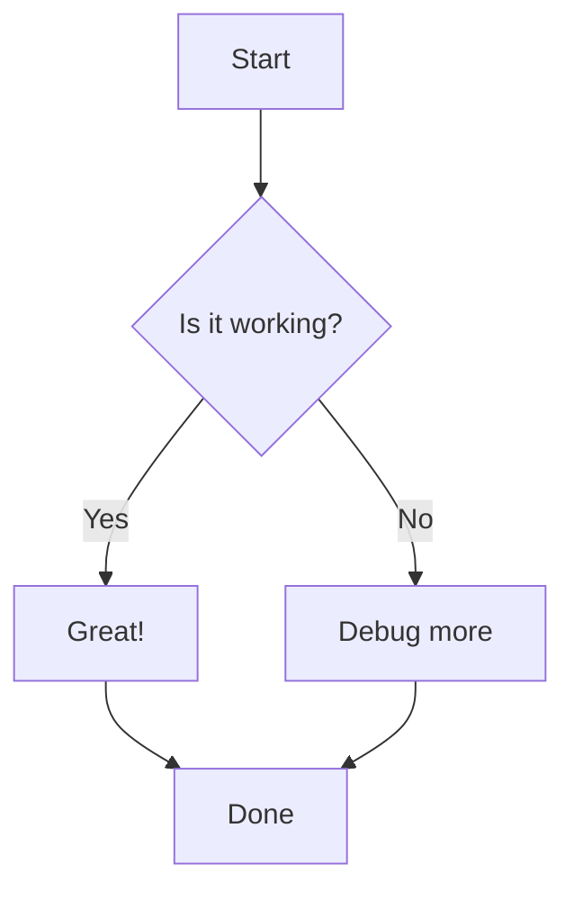
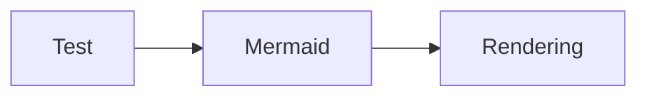

# Mermaid Test Page

This is a simple test page to debug Mermaid rendering.

**🔄 Triggering rebuild to test GitHub Pages configuration...**

## Simple Diagram

## Another Test

## Status Check

If you can see rendered diagrams above (not code blocks), then Mermaid is working! 🎉

End of test.